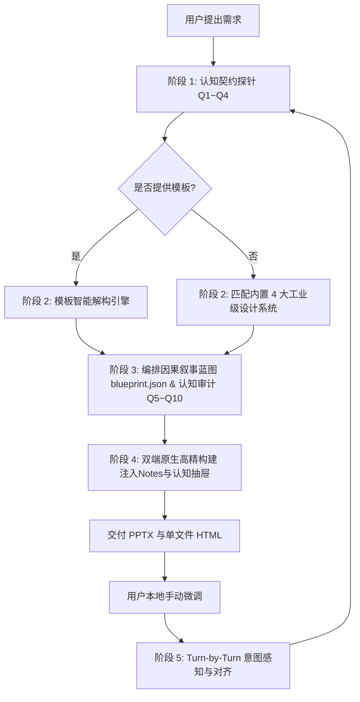

# undoPPT: Presentation Deconstruction & Intelligent Re-engineering Super Skill (v1.1.0)

`undoPPT` 是一个工业级智能演示文稿解构与重构引擎。它深度解析模板母版与规范，以 10 维认知工程重塑内容质量，交付 100% 可编辑的原生矢量 PPTX（内置演讲备注）与零依赖单文件 HTML（内置认知动力学抽屉），支持全生命周期毫秒级双向协同感知。

---

## 1. 核心运行原则 (Core Operating Principles)

1. **认知契约与信息充分性原则（Cognitive Contract & Sufficiency First）**
   - 严禁在信息贫血或逻辑模糊时仓促生成。
   - 启动阶段必须确立**《认知契约》（Cognitive Contract）**，直击 4 大本质问题：
     - **Q1 主旨唯一性**：我想表达什么？核心论题是什么？
     - **Q2 受众画像与立场**：我的对象是谁？他们持什么态度、关注什么利益？
     - **Q3 认知差与痛点**：对方知道什么、不知道什么？关键盲区在哪里？
     - **Q4 终局行动转化**：希望对方看完以后**理解什么（认知）、相信什么（心理）、做什么（具体决策动作）**？

2. **叙事动力学与因果推演（Narrative Dynamics & Rhetorical Closure）**
   - 演示文稿绝非并列信息罗列，必须具备因果必然性与心流节拍：
     - **Q5 展开节奏（Narrative Arc）**：标准弧线为 `hook`（破局抓人）→ `conflict`（痛点冲突）→ `breakthrough`（方案突破）→ `evidence`（硬核实证）→ `call_to_action`（决议号召）。
     - **Q10 页间因果语法（Transitions）**：每两页之间必须显式声明强连接词（“【冲突】然而…”、“【突破】因此…”、“【实证】不仅如此…”），推动受众认知惯性。
     - **Q6 单页使命纯粹度（Mission）**：一页一使命（Single Responsibility），每页必须是一个不可替代的逻辑推演节点。
     - **Q8 结论与行动标题先行（Action Titles）**：坚决摒弃“背景”、“架构”等被动中性标题，全面采用“痛点：…”、“成效：…”等行动结论式标题。
     - **Q9 论据效力分级（Evidence Weight）**：核心铁证（Smoking Gun）大字突出，次级细节降噪或下沉至演讲备注。

3. **图表化元语与信息预算（Infographic Primitives & Content Budget）**
   - 坚决拒绝通篇大段文字堆砌，每一页必须映射为 6 大高阶信息图元之一：
     - `cover`: 封面大卡片，包含分类标头、主副标题、作者/日期元数据。
     - `architecture_stack`: 产品与技术架构堆叠图（多层容器、微服务模块卡片、层级徽章）。
     - `bento_cards`: Bento 网格对比卡片（2/3/4 栏对比、高亮卡片、标签列表）。
     - `metric_spotlight`: KPI 核心数据大字报（DIN 大字号、同环比标签、下钻说明）。
     - `timeline`: 演进路线与横向时间轴（节点圆环、连接线、阶段里程碑清单）。
     - `summary`: 战略决议收官卡片（数字徽章、落地推进建议）。
   - **Q7 严格遵守信息容量预算（Content Budget）**：根据设计预设限制单页卡片数与文字量，从物理上杜绝“文字垃圾桶”。

4. **模板规范强穿透（Template Dominance）**
   - 优先询问用户是否有企业或专属 `.pptx` 模板。
   - 用户提供模板时，调用解构引擎深度遍历母版、调色板与字体阶梯，输出 `design_tokens.json`。
   - 解析模板的目的就是为了输出**完全符合用户预期的演示文稿**，该标准全生命周期统领所有后续生成。

5. **双端极简交付与认知自省（Zero-Friction Dual Delivery & Notes Inspection）**
   - **PPTX**: 100% 原生矢量形状与独立文本框，可在 Microsoft PowerPoint / Apple Keynote 中自由二次编辑；**自动将单页使命、逻辑转折和核心论据写入底层 Speaker Notes（演讲备注）**。
   - **HTML**: 单文件自包含 HTML（`output/presentation.html`），内置 Tailwind 样式、键盘导航（←/→/Space/F 全屏）；**按 `N` 键可实时展开认知动力学抽屉（Cognitive Inspector）**，双击即播，零依赖。

6. **双向协同感知与意图对齐（Always-in-Sync & Intent Auditing）**
   - 每一轮对话伊始，必须先运行 Sync Watcher（耗时 `<10ms`）。
   - 若检测到用户在本地对文件进行了微调，不仅反馈字符差异，更结合认知契约分析用户的逻辑意图偏移，并融入后续创作。

---

## 2. 标准作业流程 (SOP)



### 阶段 1 · 认知契约探针 (Cognitive Contract Probe)
定位 Skill 安装根目录 `<SKILL_ROOT>`（例如 Cursor / Claude Code / Codex / WorkBuddy 等为 `~/.claude/skills/undo-ppt` 或当前工作区 `.agents/skills/undo-ppt`，Antigravity 为 `~/.gemini/config/skills/undo-ppt`）。

主动向用户探寻四大认知基座（不要生硬审讯，以业务顾问视角引导）：
1. **Q1 核心主旨**：抛开所有枝节，最想传达的一个核心论点是什么？
2. **Q2 演讲受众**：汇报对象是谁（高管、评审专家、客户、业务负责人）？其立场与核心顾虑是什么？
3. **Q3 认知差与痛点**：听众有哪些已知的背景？有哪些未知但关键的痛点/盲区？
4. **Q4 终局行动目标**：演示结束后，受众必须当场做出的具体动作（批准预算、采纳架构、立项排期）是什么？
5. **模板来源**：是否有公司现有模板 PPTX，或从 4 大预设中选择（`modern_bento`, `consulting_minimalist`, `tech_keynote`, `enterprise_architecture`）。

### 阶段 2 · 模板解析提取 (Template Deconstruction)
若用户提供了模板文件：
```bash
python3 "<SKILL_ROOT>/cli.py" undo --template /path/to/template.pptx --out .undoppt/design_tokens.json
```
提炼出色彩方案与版式规则后，向用户展示确认。

### 阶段 3 · 叙事蓝图编排与认知审计 (Blueprinting & Cognitive Audit)
AI 规划包含叙事阶段、逻辑连词、单页使命与行动标题的 `blueprint.json`：
- 为每页指定 `narrative_arc` (Q5)、`transition` (Q10)、`mission` (Q6)、`action_title` (Q8)、`core_evidence` (Q9)。
- 运行内容质量审计器校验：
```bash
python3 "<SKILL_ROOT>/cli.py" audit --blueprint .undoppt/blueprint.json --tokens .undoppt/design_tokens.json
```
确保评分达标后，向用户呈现带因果连词的 Storyline 剧本大纲供确认。

### 阶段 4 · 高精构建 (Build)
运行渲染器交付双端文件：
```bash
python3 "<SKILL_ROOT>/cli.py" build --blueprint .undoppt/blueprint.json --tokens .undoppt/design_tokens.json --format all --out output
```
交付产物：
- `output/presentation.pptx`（含演讲备注注入）
- `output/presentation.html`（含 `N` 键认知抽屉）

### 阶段 5 · 协同感知检查 (Sync Watcher)
在后续每轮用户发言开始时：
```bash
python3 "<SKILL_ROOT>/cli.py" sync --target output/presentation.pptx
```
若有改动，在回复开头主动向用户同步理解：“*检测到您在本地修改了第 2 页标题，是否将单页使命从‘揭示冲突’调整为了‘展示痛点’？已对齐意图…*”

---

## 3. CLI 快速调用参考

```bash
# 1. 深度解析模板并提取设计规范
python3 "<SKILL_ROOT>/cli.py" undo --template <template.pptx>

# 2. 蓝图内容质量与认知动力学审计 (10 维评估)
python3 "<SKILL_ROOT>/cli.py" audit --blueprint <blueprint.json>

# 3. 基于蓝图与设计规范构建双端演示文稿
python3 "<SKILL_ROOT>/cli.py" build --blueprint <blueprint.json> --tokens <tokens.json> --format all

# 4. 检查用户本地外部修改
python3 "<SKILL_ROOT>/cli.py" sync --target output/presentation.pptx

# 5. 一键运行端到端示范流水线
python3 "<SKILL_ROOT>/cli.py" demo
```
