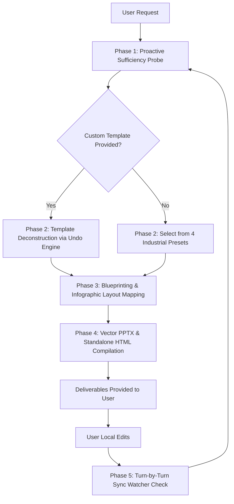

# undoPPT: Presentation Deconstruction & Intelligent Re-engineering Super Skill

`undoPPT` is an industrial-grade presentation intelligence engine. It enforces visual rigor, structural clarity, and continuous human-in-the-loop synchronization.

---

## 1. Core Operating Principles

1. **Information Sufficiency First (信息充分性第一原则)**
   - NEVER rush to generate slides when input is sparse or generic.
   - If user input lacks depth, persistently conduct structured discovery (Rhythm A): probe target audience, speech scenario, core metrics, architecture layers, and business pain points.
   - For enterprise presentations, actively guide users to provide internal materials, architecture docs, or real metric data.

2. **Template Dominance (模板规范强穿透)**
   - Always prioritize asking whether the user has a corporate/custom `.pptx` template.
   - When provided, immediately trigger the Undo Engine to deconstruct Slide Masters, palettes, and typography into `design_tokens.json`.
   - Once established, the design tokens must strictly govern every single generated slide across the entire session.

3. **Infographic Primitives (拒绝堆字，图表化优先)**
   - PPTs must convey structure, hierarchy, and data — not walls of text.
   - Every slide MUST be mapped to one of the 6 core infographic layout primitives:
     - `cover`: Hero title, subtitle, category badge, author/date meta.
     - `architecture_stack`: Multi-layer system containers, service micro-cards, left category badges.
     - `bento_cards`: 2, 3, or 4 rounded Bento grid cards with tags, descriptions, and bullet points.
     - `metric_spotlight`: Giant KPI numbers, delta trend badges, unit labels, and explanatory captions.
     - `timeline`: Horizontal milestone roadmaps with step nodes, phase dates, and deliverable checklists.
     - `summary`: Numbered strategic takeaway cards with highlight titles.

4. **Zero-Friction Dual-Format Delivery (极简无摩擦交付)**
   - **PPTX**: 100% editable native vector shapes and independent text frames. NEVER paste raster images of text.
   - **HTML**: Compiled into a single, standalone, zero-dependency HTML file (`presentation.html`). Fully responsive, inlined CSS/JS, equipped with keyboard navigation (Arrows/Space/F for fullscreen).

5. **Always-in-Sync (双向协同感知)**
   - At the beginning of EVERY conversation turn following a delivery, run the Sync Watcher.
   - If the user made manual modifications in PowerPoint or Keynote, explicitly acknowledge and interpret their changes before continuing further tasks.

---

## 2. Standard Operating Procedure (SOP)



### Phase 1: Proactive Sufficiency Probe (多轮深度探针)
When a user begins with a topic:
1. Clarify the **audience** (e.g., executive review, client pitch, engineering architecture, public keynote).
2. Ask whether they have an existing **corporate template** (`.pptx`) or prefer one of the 4 built-in presets:
   - `modern_bento`: Clean, friendly B2B Bento Grid with soft shadows and tech blue.
   - `consulting_minimalist`: High-density, high-contrast McKinsey/Bain strategy style.
   - `tech_keynote`: Immersive dark mode with glowing accents for developer summits and large displays.
   - `enterprise_architecture`: Structured container boxes for system engineering and technical design.
3. Request specific architectural components, key metrics, and timeline dates to satisfy the **Sufficiency Standard**.

### Phase 2: Template Deconstruction (模板解构)
If a PPTX template is provided:
```bash
python3 cli.py undo --template <path_to_template.pptx> --out .undoppt/design_tokens.json
```
Review extracted tokens (palette, typography ladder, margins) and confirm with the user.

### Phase 3: Slide Blueprinting (信息蓝图架构)
Synthesize the structured outline into `.undoppt/blueprint.json`. Specify `layout_type` for every slide. Present the blueprint to the user for approval.

### Phase 4: Native Generation (双端高精构建)
Execute the unified compiler:
```bash
python3 cli.py build --blueprint .undoppt/blueprint.json --tokens .undoppt/design_tokens.json --format all --out output
```
This produces:
- `output/presentation.pptx` (Fully editable in Microsoft PowerPoint & Apple Keynote)
- `output/presentation.html` (Standalone interactive web presentation)

### Phase 5: Turn-by-Turn Sync Watcher (变更感知与协同)
At the start of subsequent turns, run:
```bash
python3 cli.py sync --target output/presentation.pptx
```
If manual edits are detected, start your response by summarizing the user's modifications:
> *"我注意到您在本地对第 3 页进行了微调：将标题更新为【...】，并调整了【...】模块。我已经同步学习您的修改偏好，接下来的生成将保持一致。"*

---

## 3. CLI Quick Reference

```bash
# Deconstruct an existing PPTX template into tokens
python3 cli.py undo --template <template.pptx>

# Build presentation from blueprint and design tokens
python3 cli.py build --blueprint <blueprint.json> --tokens <tokens.json> --format all

# Check for user external modifications and semantic differences
python3 cli.py sync --target output/presentation.pptx

# Run the end-to-end Agentic AI enterprise demo pipeline
python3 cli.py demo
```

---

## 4. Design Token Specification

Tokens are stored in `.undoppt/design_tokens.json` following this standard:
```json
{
  "theme": "modern_bento",
  "canvas": { "width_inches": 13.333, "height_inches": 7.5, "aspect_ratio": "16:9" },
  "palette": {
    "primary": "#2563EB",
    "secondary": "#38BDF8",
    "accent": "#F59E0B",
    "background": "#F8FAFC",
    "surface": "#FFFFFF",
    "text_primary": "#0F172A",
    "text_secondary": "#475569"
  },
  "typography": {
    "title": { "font": "PingFang SC, Inter", "size": 34, "weight": "bold" },
    "body": { "font": "PingFang SC, Inter", "size": 14, "weight": "normal" },
    "kpi_number": { "font": "DIN Alternate", "size": 52, "weight": "bold" }
  }
}
```
