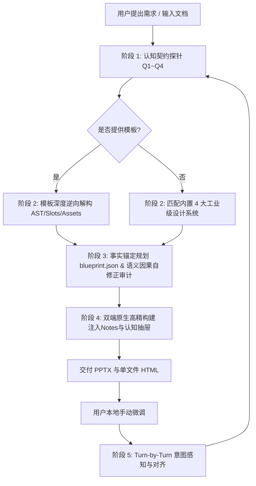

# undoPPT: Presentation Deconstruction & Intelligent Re-engineering Super Skill (v2.5.0)

`undoPPT` 是一个工业级智能演示文稿解构与重构引擎。它深度解析模板母版与规范，以 10 维认知工程与深度语义因果审计重塑内容质量，交付 100% 可编辑的原生矢量 PPTX（内置演讲备注）与零依赖单文件 HTML（内置认知动力学抽屉），支持全生命周期毫秒级双向协同感知。

---

## 1. 核心运行原则 (Core Operating Principles)

1. **认知契约与信息充分性原则（Cognitive Contract & Sufficiency First）**
   - 严禁在信息贫血或逻辑模糊时仓促生成。
   - 启动阶段必须确立**《认知契约》（Cognitive Contract）**，直击 4 大本质问题：
     - **Q1 主旨唯一性**：我想表达什么？核心论题是什么？
     - **Q2 受众画像与立场**：我的对象是谁？他们持什么态度、关注什么利益？
     - **Q3 认知差与痛点**：对方知道什么、不知道什么？关键盲区在哪里？
     - **Q4 终局行动转化**：希望对方看完以后**理解什么（认知）、相信什么（心理）、做什么（具体决策动作）**？

2. **叙事动力学与深度语义因果审计（Narrative Dynamics & Semantic Cognitive Audit）**
   - 演示文稿绝非并列信息罗列，必须具备因果必然性与心流节拍：
     - **Q5 展开节奏（Narrative Arc）**：标准弧线为 `hook`（破局抓人）→ `conflict`（痛点冲突）→ `breakthrough`（方案突破）→ `evidence`（硬核实证）→ `call_to_action`（决议号召）。
     - **Q10 页间因果语法（Transitions）**：每两页之间必须显式声明强连接词（依据因果本体：对立冲突、因果推导、破局突破、递进深化、实证支撑、决议行动）。
     - **Q6 单页使命纯粹度（Mission）**：一页一使命（Single Responsibility），每页必须是一个不可替代的逻辑推演节点。
     - **Q8 结论与行动标题先行（Action Titles）**：坚决摒弃“背景”、“架构”等被动中性标题，全面采用“痛点：…”、“成效：…”等行动结论式标题。
     - **Q9 论据效力分级（Smoking Gun Evidence Weight）**：核心铁证大字突出并带硬核量化数据（百分比、比率、工时、毫秒级延迟），次级细节降噪或下沉至演讲备注。
     - **语义离心漂移检测**：核验每一页核心概念与顶层主旨的语义向心力，杜绝跑题。

3. **动态事实锚定与自修正规划（Dynamic Grounded Planning & Self-Correction）**
   - 支持解析外部参考文档（`--input-doc`），自动提取真实业务指标（如“418个”、“80%”、“7:2:1转向4:3:3”）、组织层级与核心痛点。
   - 规划器内置自反思修正循环（Autonomous Refinement Loop），生成蓝图后自动运行认知审计，若发现被动标题、缺少过渡或证据单薄，自动完成二次修补优化。

4. **母版 AST 深度逆向解构（Deep Master AST Decompiler）**
   - 深度提取母版占位符（Title, Body, Subtitle, Footer）绝对坐标与相对比例。
   - 自动识别暗黑/明亮主题模式（Dark/Light Theme Mode）并调整配色方案。
   - 自动提取母版与页面中嵌入的高清媒体、矢量 Logo 至 `.undoppt/assets/`。

5. **图表化元语与信息预算（Infographic Primitives & Content Budget）**
   - 坚决拒绝通篇大段文字堆砌，每一页必须映射为 10 大高阶信息图元之一：
     - `cover`: 封面大卡片，包含分类标头、主副标题、作者/日期元数据。
     - `architecture_stack`: 产品与技术架构堆叠图（多层容器、微服务模块卡片、层级徽章）。
     - `bento_cards`: Bento 网格对比卡片（2/3/4 栏对比、高亮卡片、标签列表）。
     - `metric_spotlight`: KPI 核心数据大字报（DIN 大字号、同环比标签、下钻说明）。
     - `timeline`: 演进路线与横向时间轴（节点圆环、连接线、阶段里程碑清单）。
     - `matrix_2x2`: 2x2 四象限战略决策矩阵（技术广度 × 控制力、XY轴标签、原则侧栏）。
     - `maturity_ladder`: 多维成熟度阶梯与进阶模型（四级演进台阶、核心抓手、考核指标、安全底线）。
     - `horizons_curve`: 三道地平线发展模型（H1效率复制、H2流程突破、H3新模式验证、分池管理看板）。
     - `cross_mapping`: 跨层级/跨组织对齐映射表（双向对齐箭头、标杆实践对比、落地机制责任链）。
     - `summary`: 战略决议收官卡片（数字徽章、落地推进建议）。
   - **Q7 严格遵守信息容量预算（Content Budget）**：根据设计预设限制单页卡片数与文字量，从物理上杜绝“文字垃圾桶”。

6. **双端极简交付与认知自省（Zero-Friction Dual Delivery & Notes Inspection）**
   - **PPTX**: 100% 原生矢量形状与独立文本框，可在 Microsoft PowerPoint / Apple Keynote 中自由二次编辑；**自动将单页使命、逻辑转折和核心论据写入底层 Speaker Notes（演讲备注）**。
   - **HTML**: 单文件自包含 HTML（`output/presentation.html`），内置 Tailwind 样式、键盘导航（←/→/Space/F 全屏）；**按 `N` 键可实时展开认知动力学抽屉（Cognitive Inspector）**，双击即播，零依赖。

7. **双向协同感知与意图对齐（Always-in-Sync & Intent Auditing）**
   - 每一轮对话伊始，先运行 Sync Watcher（耗时 `<10ms`）。
   - 若检测到用户在本地对文件进行了微调，不仅反馈字符差异，更结合认知契约分析用户的逻辑意图偏移，并融入后续创作。

---

## 2. 标准作业流程 (SOP)



### 阶段 1 · 认知契约探针 (Cognitive Contract Probe)
主动向用户探寻四大认知基座（不要生硬审讯，以业务顾问视角引导）：
1. **Q1 核心主旨**：抛开所有枝节，最想传达的一个核心论点是什么？
2. **Q2 演讲受众**：汇报对象是谁？其立场与核心顾虑是什么？
3. **Q3 认知差与痛点**：听众有哪些已知的背景？有哪些未知但关键的痛点/盲区？
4. **Q4 终局行动目标**：演示结束后，受众必须当场做出的具体动作是什么？
5. **参考输入**：是否有事实文档（`--input-doc`）或现有模板 PPTX。

### 阶段 2 · 模板解析提取 (Template Deconstruction)
若用户提供了模板文件：
```bash
python3 "<SKILL_ROOT>/cli.py" undo --template /path/to/template.pptx --out .undoppt/design_tokens.json
```
提炼出色彩方案、主题模式（Dark/Light）、母版占位槽位与版式规则后，向用户展示确认。

### 阶段 3 · 叙事蓝图编排与语义因果自修正审计
运行自主认知规划器（支持事实文档挂载）：
```bash
python3 "<SKILL_ROOT>/cli.py" plan --prompt "<提示词>" [--input-doc <file.md>] [--out .undoppt/blueprint.json]
```
规划器会自动完成因果语法编排、铁证注入与自修正审计：
```bash
python3 "<SKILL_ROOT>/cli.py" audit --blueprint .undoppt/blueprint.json --tokens .undoppt/design_tokens.json
```
输出包含结构分、语义分（因果推进、主旨离心、硬证据加权、疑虑对抗）的完整体检报告。

### 阶段 4 · 高精构建 (Build)
运行渲染器交付双端文件：
```bash
python3 "<SKILL_ROOT>/cli.py" build --blueprint .undoppt/blueprint.json --tokens .undoppt/design_tokens.json --format all --out output
```
交付产物：
- `output/presentation.pptx`（含演讲备注注入）
- `output/presentation.html`（含 `N` 键认知抽屉）

### 阶段 5 · 协同感知检查 (Sync Watcher)
在后续每轮用户发言开始时：
```bash
python3 "<SKILL_ROOT>/cli.py" sync --target output/presentation.pptx
```

---

## 3. CLI 快速调用参考

```bash
# 1. 自主认知规划器 (提示词 + 可选事实文档 -> 审计自修正蓝图)
python3 "<SKILL_ROOT>/cli.py" plan --prompt "<提示词>" [--input-doc <file.md>] [--out blueprint.json]

# 2. 一键全流程极速生成 (规划 -> 事实锚定 -> 审计 -> 双端构建)
python3 "<SKILL_ROOT>/cli.py" generate --prompt "<提示词>" [--input-doc <file.md>] [--template <template.pptx>] [--format all] [--out output/]

# 3. 深度解析模板母版与设计规范
python3 "<SKILL_ROOT>/cli.py" undo --template <template.pptx>

# 4. 蓝图内容质量与深度语义因果审计 (结构分 + 语义分 + 4大子项)
python3 "<SKILL_ROOT>/cli.py" audit --blueprint <blueprint.json>

# 5. 基于蓝图与设计规范构建双端演示文稿
python3 "<SKILL_ROOT>/cli.py" build --blueprint <blueprint.json> --tokens <tokens.json> --format all

# 6. 检查用户本地外部修改
python3 "<SKILL_ROOT>/cli.py" sync --target output/presentation.pptx

# 7. 一键运行端到端示范流水线
python3 "<SKILL_ROOT>/cli.py" demo
```
