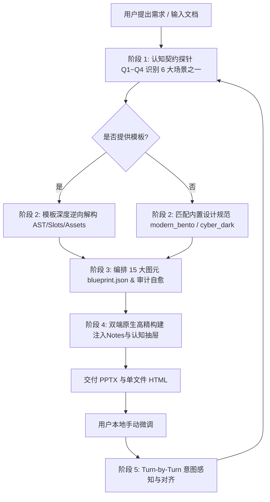

# undoPPT: Presentation Deconstruction & Intelligent Re-engineering Super Skill (v3.4.0)

`undoPPT` 是一个工业级通用智能演示文稿解构与重构引擎。它深度解析模板母版与规范，全面解耦领域硬编码，支持企业 **12 大核心实战场景**（立项答辩、年度战略、QBR复盘、跨团队拉通、人头预算评审、RFC架构评审、故障复盘、GTM产品发布、大客户竞标、晋升述职、技术内训、全员动员）并锚定于 6 大通用场景原型。系统严格遵循“软性认知与硬性约束解耦”的设计哲学（详见 [DESIGN_PHILOSOPHY.md](DESIGN_PHILOSOPHY.md) / [中文白皮书](DESIGN_PHILOSOPHY_zh.md) 与 [Blueprint 规约手册](docs/en/blueprint_specification.md)）：Agent 充当战略顾问与认知主编，Skill 充当物理排版流水线与独立质检员。引擎提供 **15 大高阶信息图元**（含决策闭环对比卡、原生矢量图表与规整数据表格），交付 100% 可编辑的原生矢量 PPTX（内置场景口播演讲备注与 `<p:timing>` 原生时序步进）与零依赖单文件 HTML（内置 `P` 键演播中枢 HUD、`N` 键认知抽屉与活动决策沙盒），支持全生命周期双向意图反思。

---

## 1. 核心运行原则 (Core Operating Principles)

1. **认知契约先行（Cognitive Contract & Multi-Scenario Sufficiency）**
   - 严禁在信息贫血或逻辑模糊时仓促生成，坚决不预设硬编码公司或案例。
   - 确立顶层**《认知契约》（Cognitive Contract）**：
     - **Q1 主旨唯一性**：核心论题与观点先行（Core Thesis）。
     - **Q2 受众画像与立场**：受众角色（高管、评委、HRD、学员、投资人）与其核心痛点。
     - **Q3 认知差与盲区**：对方已知基准 vs 未知盲区/痛点（Knowledge Delta）。
     - **Q4 终局行动转化**：看完后理解什么（Understand）、相信什么（Believe）、做出什么动作（Act）。

2. **企业 12 大场景深度适配与 6 大原型解耦（The 12 Enterprise Operational Scenarios）**
   - **立项答辩 (`project_charter`) / 年度战略 (`annual_strategy_okr`)**: 归属战略规划原型，聚焦投资收益比、三道地平线与资源边界。
   - **QBR经营复盘 (`qbr_business_review`) / 跨部门拉通 (`cross_team_alignment`) / 人头预算评审 (`team_headcount_review`)**: 归属综合专题原型，聚焦数据偏差归因、权责边界与人效ROI。
   - **技术选型RFC (`tech_rfc_review`) / 故障复盘 (`post_mortem_review`)**: 归属技术架构原型，聚焦系统解耦、可用性SLA、容灾回滚与防呆治理。
   - **GTM上市推进 (`product_launch_gtm`) / 大客户竞标 (`enterprise_rfp_pitch`)**: 归属商业路演原型，聚焦客群痛点、产品杀手级特性、交付SLA与定价模型。
   - **晋升述职 (`promotion_assessment`)**: 归属个人履历原型，聚焦净增量归因、STAR战绩、方法论沉淀与下一职级承诺。
   - **技术内训 (`internal_tech_talk`) / 全员动员 (`all_hands_rally`)**: 归属教育培训原型，聚焦盲区击穿、实操对照、使命誓师与行为公约。

3. **终局“请领导决策事项”规约 (Decision-Ready Ask)**
   - 汇报给管理层与评委的报告，收尾必须由“信息宣讲”升级为“决策促成”。
   - 最后一页支持配置方案对比矩阵 (`options`：各方案利弊、成本、风险与推荐标识)、作者核心推荐理由 (`recommendation`) 以及明确的待批决议清单 (`sign_off_items`)。
   - PPTX 渲染高亮推荐方案与勾选审批栏，HTML 渲染真实可勾选的决策控制台。

4. **立体客观对标规约 (3-Way Benchmarking Rigor)**
   - 严禁“我方全优、竞品全劣”的虚假狂妄对比。
   - 必须建立三维参照系：行业标杆 vs 直接竞品 vs 维持现状成本，客观披露自身妥协、迁移摩擦与适用边界。

5. **晋升述职 STAR 深度归因与去噪 (Authentic Promotion Attribution)**
   - 严禁堆砌日常事务流水账。
   - 必须剥离大盘自然增长红利，通过 STAR 框架证明个人的净增量价值，并提炼跨团队可复用的方法论。

6. **15 大图元规约与信息密度预算（15 Layout Primitives & Content Density Budget）**
   每一页必须映射为 15 种标准信息图元之一，坚决杜绝无结构的纯文本大段堆砌：
   - 基础与决策：`cover`, `bento_cards`, `architecture_stack`, `metric_spotlight`, `timeline`, `summary` (含决策闭环)
   - 战略与推演：`matrix_2x2`, `maturity_ladder`, `horizons_curve`, `cross_mapping`
   - 数据与表现：`standard_table`, `data_chart`, `content_columns`, `keynote_quote`, `process_flow`

7. **100% 原生双端高精交付**
   - **PPTX**: 原生矢量形状、规整表格与 `CategoryChartData` 矢量图表对象；自动注入场景演讲口播备注与 `<p:timing>` 原生时序步进。
   - **HTML**: 单文件自包含 HTML，内置 `P` 键演播中枢 HUD、`N` 键认知抽屉、活动决策推演沙盒与交互式勾选审批清单。

8. **图元内生语义动力学与活动沙盒（Semantic Dynamics & Active Sandbox）**
   - 15 大图元内生语义物理动效（架构栈自下而上扎根、时间轴脉冲流光、KPI 跑表、阶梯攀升）。
   - HTML 端支持切换保守/基准/激进情境重算图表，架构栈原位下钻 SLA 依赖。


---

## 2. 15 大图元 JSON Blueprint 规范 (Schema Reference)

AI Agent 既可以通过 CLI 生成，也可以**直接编写 `blueprint.json`** 并调用 `cli.py build` 进行高精构建。以下为 15 种图元的标准化数据结构：

### 通用元数据字段（每一页必须具备）
```json
{
  "layout_type": "<15种图元之一>",
  "narrative_arc": "hook | conflict | breakthrough | evidence | progression | call_to_action",
  "mission": "本页唯一的认知使命（Q6）",
  "transition": "【承上启下】连接上一页的因果或转折连词（Q10）",
  "action_title": "行动/结论先行标题（Q8）",
  "core_evidence": "硬核量化数据指标或典型案例支撑（Q9）",
  "title": "主标题",
  "subtitle": "副标题/补充说明"
}
```

### 15 种布局专有数据结构
1. **`cover` (封面卡片)**
   `"category"`: 分类标头, `"title"`: 大标题, `"subtitle"`: 副标题, `"meta"`: 作者/日期/密级
2. **`bento_cards` (网格卡片对比)**
   `"cards"`: `[{"tag": "TAG", "title": "标题", "desc": "说明", "bullets": ["点1", "点2"], "highlight": true|false}]` (2~4张)
3. **`architecture_stack` (分层架构栈)**
   `"layers"`: `[{"name": "层级名", "desc": "定位说明", "items": ["组件1", "组件2", "组件3"]}]` (3~4层)
4. **`metric_spotlight` (KPI 关键数据大字报)**
   `"metrics"`: `[{"label": "指标名", "value": "94.8%", "delta": "同比+30%", "desc": "指标说明"}]` (3~4项)
5. **`timeline` (时间轴里程碑)**
   `"steps"`: `[{"time": "阶段/时间", "title": "阶段目标", "items": ["成果1", "成果2"]}]` (3~4步)
6. **`matrix_2x2` (2x2 四象限决策矩阵)**
   `"quadrants"`: `[{"name": "象限名", "desc": "特征描述", "tag": "策略标签"}]` (4项), `"axes"`: `{"x": "X轴维度", "y": "Y轴维度"}`
7. **`maturity_ladder` (成熟度进阶阶梯)**
   `"levels"`: `[{"step": "L1", "name": "起步期", "desc": "描述", "target": "目标", "focus": "抓手", "metric": "指标"}]` (3~5级)
8. **`horizons_curve` (三道地平线模型)**
   `"horizons"`: `[{"horizon": "H1", "name": "当前主业", "desc": "描述", "focus": "侧重", "kpi": "核心指标"}]` (3层)
9. **`cross_mapping` (跨层级对齐映射)**
   `"mapping_rows"`: `[{"layer": "业务层", "current": "现状痛点", "target": "目标解法", "action": "牵引抓手"}]` (3~5行)
10. **`summary` (收官行动与战略决议)**
    `"points"`: `[{"title": "行动要点标题", "desc": "详细落地行动与推进机制"}]` (3~4条)
11. **`standard_table` (规整数据与能力对比表) [v3.0]**
    `"headers"`: `["维度", "指标A", "指标B", "结论"]`,
    `"rows"`: `[["数据1", "数据2", "数据3", "优"], ["数据4", "数据5", "数据6", "胜出"]]`
12. **`data_chart` (原生矢量数据图表) [v3.0]**
    `"chart_type"`: `"column_clustered" | "line" | "pie"`,
    `"categories"`: `["类目1", "类目2", "类目3", "类目4"]`,
    `"series"`: `[{"name": "系列A", "values": [30, 45, 80, 95]}, {"name": "系列B", "values": [20, 35, 60, 85]}]`
13. **`content_columns` (多栏并列内容卡片) [v3.0]**
    `"columns"`: `[{"title": "栏目标题", "tag": "标签", "points": ["核心要点1", "核心要点2", "核心要点3"]}]` (2~4栏)
14. **`keynote_quote` (金句引用与核心观点破局) [v3.0]**
    `"quote_text"`: "核心洞见金句或专家名言",
    `"author"`: "作者/出处", `"author_title"`: "头衔/行业背景", `"key_takeaway"`: "核心推论与破局启示"
15. **`process_flow` (横向流程步骤推演) [v3.0]**
    `"steps"`: `[{"step": "01", "name": "阶段名称", "desc": "执行机制与关键交付物"}]` (3~6步)

---

## 3. 标准作业流程 (SOP)



### 阶段 1 · 认知契约探针 (Cognitive Contract Probe)
探寻四大认知基座（以顾问视角提问，不生硬审讯）：
1. **Q1 核心主旨**：抛开所有枝节，最想传达的一个核心论点是什么？
2. **Q2 演讲受众**：汇报对象是谁？其立场与核心顾虑是什么？
3. **Q3 认知差与痛点**：听众已知什么？未知但关键的痛点/盲区是什么？
4. **Q4 终局行动目标**：演示结束后，受众必须做出的具体动作/决策是什么？
5. **场景原型**：属于战略规划、技术架构、产品路演、个人履历、教育教学还是通用汇报？

### 阶段 2 · 模板解析提取 (Template Deconstruction)
若用户提供了模板文件：
```bash
python3 "<SKILL_ROOT>/cli.py" undo --template /path/to/template.pptx --out .undoppt/design_tokens.json
```

### 阶段 3 · 蓝图编排与质量审计 (Plan & Audit)
方式 A（CLI 自主规划）：
```bash
python3 "<SKILL_ROOT>/cli.py" plan --prompt "<提示词>" [--input-doc <file.md>] [--out .undoppt/blueprint.json]
```
方式 B（Agent 智能编排）：Agent 直接依据上述 15 大图元规约构造 `.undoppt/blueprint.json`。

运行 10 维认知质量与深度语义审计：
```bash
python3 "<SKILL_ROOT>/cli.py" audit --blueprint .undoppt/blueprint.json --tokens .undoppt/design_tokens.json
```

### 阶段 4 · 双端高精构建 (Build)
```bash
python3 "<SKILL_ROOT>/cli.py" build --blueprint .undoppt/blueprint.json --tokens presets/modern_bento.json --format all --out output
```
交付产物：
- `output/presentation.pptx`（原生矢量对象、图表、表格、演讲备注、ECMA-376 `<p:timing>` 原生时序步进）
- `output/presentation.html`（单文件自包含、Tailwind 排版、`P` 键演播中枢 HUD、`N` 键认知抽屉、情景切换决策沙盒）

### 阶段 5 · 协同感知与意图对齐 (Sync Watcher)
在后续每轮用户发言开始时：
```bash
python3 "<SKILL_ROOT>/cli.py" sync --target output/presentation.pptx
```

---

## 4. CLI 快速调用参考

```bash
# 1. 自主认知规划器 (6 大场景自适应)
python3 "<SKILL_ROOT>/cli.py" plan --prompt "<提示词>" [--input-doc <file.md>] [--out blueprint.json]

# 2. 一键全流程极速生成 (规划 -> 场景装配 -> 审计 -> 双端构建)
python3 "<SKILL_ROOT>/cli.py" generate --prompt "<提示词>" [--input-doc <file.md>] [--template <template.pptx>] [--format all] [--out output/]

# 3. 深度解析模板母版与设计规范
python3 "<SKILL_ROOT>/cli.py" undo --template <template.pptx>

# 4. 蓝图认知质量与深度语义因果审计 (结构分 + 语义分 + 4大子项)
python3 "<SKILL_ROOT>/cli.py" audit --blueprint <blueprint.json>

# 5. 基于蓝图与设计规范构建双端演示文稿 (支持 15 种图元)
python3 "<SKILL_ROOT>/cli.py" build --blueprint <blueprint.json> --tokens <tokens.json> --format all

# 6. 检查用户本地外部修改
python3 "<SKILL_ROOT>/cli.py" sync --target output/presentation.pptx

# 7. 一键运行端到端示范流水线
python3 "<SKILL_ROOT>/cli.py" demo
```

