<div align="center">

# undoPPT Design Philosophy & Architecture Synergy Whitepaper

[English](DESIGN_PHILOSOPHY.md) | [简体中文](DESIGN_PHILOSOPHY_zh.md)

</div>

> **Version**: v3.1.0  
> **Positioning**: Core design specifications and quality engineering manifesto for the next-generation presentation deconstruction & re-engineering super agent (undoPPT Super Skill).  
> **Core Manifesto**: *“A presentation is not an art album, but an audience-centric cognitive reshaping and decision intervention project.”*

---

## 1. Industry Dilemma: Why Traditional Approaches Fail at Presentations

In modern productivity and software engineering, crafting high-stakes professional presentations has historically been trapped between two flawed extremes:

```text
┌───────────────────────────────────────────┐     ┌───────────────────────────────────────────┐
│     Extreme Route A: Pure AI Agent / LLM  │     │ Extreme Route B: Legacy Template / Rules  │
├───────────────────────────────────────────┤     ├───────────────────────────────────────────┤
│ ❌ Incapable of calculating coordinates   │     │ ❌ Static placeholder fills, lifeless     │
│ ❌ Unchecked verbosity, treats PPT as Doc │     │ ❌ Lacks causal narrative progression     │
│ ❌ Outputs raster bitmaps, non-editable   │     │ ❌ Paralyzed outside generic corporate deck│
│ ❌ Cannot generate native vector charts   │     │ ❌ Blind to unstructured business context │
└───────────────────────────────────────────┘     └───────────────────────────────────────────┘
```

To resolve this dilemma, `undoPPT` establishes an architecture based on **Decoupling Soft Cognition from Hard Enforcement**:
- **Large Language Models (LLMs)** excel at high-dimensional semantic reasoning, intent discernment, and strategic consulting, but are fundamentally unreliable at calculating pixel coordinates and enforcing physical layout geometry.
- **Deterministic Engineering Engines** excel at AST template decompilation, geometric math, native vector chart compilation, and rule-based QA, but lack empathy for audience psychology and narrative flow.

Therefore, `undoPPT` defines an explicit, uncompromising separation of concerns between the two layers.

---

## 2. Division of Responsibility Matrix: Agent vs. Skill

```text
                ┌─────────────────────────────────────────────────────────┐
                │                     AI AGENT (Brain)                    │
                │   • Cognitive Contract Probe (Q1-Q4)                    │
                │   • 6-Scenario Archetype Routing                        │
                │   • Fact Ingestion & Entity Extraction                  │
                │   • 15-Primitive Narrative Composition (blueprint.json) │
                │   • Human-in-the-Loop Intent Alignment & Reflection     │
                └───────────────────────────┬─────────────────────────────┘
                                            │ Delivery Protocol: blueprint.json
                                            ▼
                ┌─────────────────────────────────────────────────────────┐
                │                 undoPPT SKILL (Engine)                  │
                │   • Master Template AST Decompilation (Undo Engine)     │
                │   • 10-Dimension Dual Cognitive Quality Auditing        │
                │   • 15 Native Vector Layout Renderers (PPTX & HTML)     │
                │   • Geometry Calculation & Design Token Enforcement     │
                │   • Sub-10ms SHA-256 Fingerprint & AST Diff Sensing     │
                └─────────────────────────────────────────────────────────┘
```

### 2.1 What is the AI Agent Responsible For? (Cognitive Core, Chief Editor & Strategic Consultant)
The Agent handles high-freedom, context-heavy cognitive tasks that demand deep semantic understanding:

1. **Cognitive Contract Probe (Q1–Q4)**:
   - Rather than conducting an interrogative questionnaire, the Agent acts as a senior management consultant to clarify four cognitive pillars:
     - **Q1 Core Message**: Stripping away noise, what is the single central thesis (Core Thesis)?
     - **Q2 Audience Profile & Stance**: Who is the audience, what risks do they fear, and what do they prioritize?
     - **Q3 Knowledge Delta & Blindspots**: What does the audience already know (Baseline) vs. what critical blindspots and pain points do they have (Knowledge Delta)?
     - **Q4 Final Target Action**: After the presentation, what should the audience understand, believe, and immediately decide or execute (Act)?
2. **Scenario Archetype Classification & Routing**:
   - Intelligently recognizes 6 universal scenario archetypes (`strategic_planning`, `tech_architecture`, `product_pitch`, `personal_resume`, `education_training`, `general_informative`) to align with audience expectations.
3. **Fact Ingestion & 15-Primitive Blueprint Composition**:
   - Distills unstructured text (`--input-doc`) and conversation history into a strictly typed `blueprint.json`;
   - Ensures each slide features:
     - **Action Titles**: Replaces passive titles with conclusion-first claims ("Pain Point: ..." or "Impact: ...");
     - **Narrative Arc**: Sequences slides through `hook ➔ conflict ➔ breakthrough ➔ evidence ➔ progression ➔ call_to_action`;
     - **Explicit Causal Transitions**: Embeds transitional conjunctions between slides to eliminate isolated information silos;
     - **Single Slide Responsibility (Mission)**: Each slide fulfills exactly one cognitive objective;
     - **Smoking Gun Evidence**: Anchors claims with quantitative metrics (percentages, ratios, latency) or pedagogical case studies.
4. **Human-in-the-Loop Alignment & Reflection**:
   - When human experts edit files locally, the Agent uses diff analysis to infer user intent and adapts subsequent rounds cooperatively.

---

### 2.2 What is the undoPPT Skill Engine Responsible For? (Hard Execution Foundation, Geometry & Quality Gates)
The Skill engine acts as an automated precision typesetting pipeline and independent quality inspector:

1. **Deep Master AST Decompiler (Undo Engine)**:
   - Traverses Slide Masters and Layouts to extract coordinates (in inches) and relative grid proportions for `Title`, `Body`, `Subtitle`, and `Footer` placeholders;
   - Computes canvas luminance to classify the visual style as `dark` or `light` mode;
   - Exports embedded high-resolution raster images and vector logos to `.undoppt/assets/`.
2. **Design Token Enforcement & Content Budgets**:
   - Centralizes palettes, secondary colors, contrasting surface tones, border radii, and typographic hierarchies;
   - Enforces content budget limits (e.g., cards ≤ 4, architecture layers ≤ 4, table rows ≤ 8, chart categories ≤ 8).
3. **100% Native Dual-Format Vector Physical Rendering (PPTX & HTML Builders)**:
   - **Zero Bitmaps**: Assembles vector shapes, cards, badges, and text frames using `python-pptx`;
   - **Native Editable Charts**: Uses `CategoryChartData` for clustered columns, lines, and pie charts. Users can double-click charts in PowerPoint or Keynote to modify underlying spreadsheet values directly;
   - **Formatted Data Tables**: Automatically calculates column widths, cell paddings, and alternating zebra stripes;
   - **Automated Speaker Notes Injection**: Writes slide missions, rhetorical transitions, and conversational talking points into PowerPoint Speaker Notes;
   - **Single-File Standalone HTML**: Compiles self-contained HTML with Tailwind CSS, full-screen presentation mode, and a slide-out Cognitive Inspector drawer triggered by the `N` key.
4. **10-Dimension Dual Cognitive Quality Auditor (Content & Semantic Auditors)**:
   - Evaluates blueprints independently of the LLM: verifies structural redlines, rhetorical transitions, thesis centroid alignment, and empirical evidence weights.
5. **Sub-10ms Always-in-Sync Watcher**:
   - Uses SHA-256 fingerprinting to detect external edits in `<10ms` and generates semantic AST diffs.

---

## 3. Why This Design? (Core Principles & Architectural Tradeoffs)

### Principle 1: Soft Cognition vs. Hard Enforcement
Large Language Models are **Thinkers**, not **Geometric Renderers**.  
Prompting an LLM to generate raw PPTX XML or guess pixel coordinates inevitably yields overflowing text, overlapping bounding boxes, and visual breakdown. `undoPPT` introduces the **15-Primitive JSON Blueprint** as an immutable contract. The Agent produces structured data; the Skill engine mounts it onto a coordinate grid deterministically.

### Principle 2: Structure Forces Brevity
LLMs have an inherent tendency to output expansive walls of text when unconstrained.  
`undoPPT` provides **zero free-form text layouts**. The engine offers only 15 high-fidelity infographic primitives (Bento cards, process flows, structured tables, vector charts, etc.), each with strict schema constraints (e.g., Bento requires 2–4 cards, each with tag/title/desc/bullets). **The rigidity of the layout primitives forces the Agent to distill ideas into crisp, high-density insights.**

### Principle 3: Always Preserve Human Intervention Agency (Always-in-Sync)
Traditional AI presentation tools operate as one-way black boxes: once a user edits a generated slide, AI iteration breaks, and regenerating overwrites all manual refinements.  
`undoPPT` treats the human expert as the ultimate decision-maker. Native vector shapes enable unconstrained manual adjustments in Office/Keynote, while the Sync Watcher senses modifications in milliseconds to keep the human and AI in lockstep.

### Principle 4: Truth-in-Evidence & Anti-Buzzword Discipline
A critical failure of AI-generated content is hiding conceptual vacuum behind pompous buzzwords ("不仅是X更是Y", "closed-loop flywheels", "5 battlefronts").  
`undoPPT` enforces an **uncompromising anti-buzzword discipline and truth-in-evidence standard**:
- **Deterministic Blacklist Interception**: Automated regex filtering blocks empty jargon and formulaic AI clichés;
- **Empirical Rigor**: Disallow fabricated benchmarks or fake precision. If empirical proof is missing, explicit labels like `[Pending Verification]` or `[Design Assumption]` are mandatory;
- **6 Archetype Red Lines**: Tech architecture mandates latency distributions (P50/P99) and rollback gates; product decks mandate unit economics; strategic plans require explicit not-to-do lists.

### Principle 5: Motion as Cognitive Pacing (Cognitive Restraint)
Presentation animation commonly degrades into circus-like acrobatics or vanishes entirely into lifeless static cards.  
`undoPPT` mandates that **motion exists solely to guide audience attention and pace cognitive disclosure**:
- **Restrained Transitions**: Subtle slide transitions (`fade` / `push`) rather than distracting rotations or acrobatics;
- **Primitive Staged Reveals**: Bento cards stagger in, architecture stacks assemble from bottom-up, maturity ladders climb step-by-step. The standalone HTML deck supports spacebar sub-step presentation mode, while PPTX maintains universal compatibility.

### Principle 6: Semantic Kinetic Physics
Legacy AI tools force LLMs to guess bounding-box coordinates and hardcode flight paths for every button and textbox.  
`undoPPT` establishes that **topology determines physics and semantics dictate gravity**:
- Each of the 15 layout primitives inherently encodes its own cognitive physical behaviors (architecture stacks lock bottom-up, timeline beams ignite stage nodes sequentially, metric counters count up with precision, matrix quadrants focus deliberately);
- The AI Agent expends zero tokens on micro-coordinates; the engine maps narrative arcs directly to kinetic physics.

### Principle 7: Elevating Static Slideware to an Active Decision Sandbox
The fatal vulnerability of traditional presentations is instant collapse when an executive questions hypothetical parameters.  
`undoPPT` transforms standalone HTML decks into an **Active Decision Sandbox**:
- Interactive scenario tabs (Conservative / Baseline / Aggressive) and sensitivity sliders recompute chart trajectories and KPIs dynamically in real-time;
- Clickable architecture drilldowns pop up SLA boundaries and failure domains;
- Equips speakers with a **Live Presenter HUD** (`P` key) featuring a Cognitive Radar, Transition Teleprompter, and an Objection & Defense Playbook.

---


## 4. Guaranteeing Quality: The 5-Layer Certainty Closed-Loop Framework

`undoPPT` incorporates a **5-Layer Quality Assurance Closed-Loop** from user input to final delivery:

```mermaid
flowchart LR
    A[Layer 1: Cognitive Contract] -->|Eliminates Ramble| B[Layer 2: 15-Primitive Schema]
    B -->|Eliminates Text Dumps| C[Layer 3: Design Tokens & Budgets]
    C -->|Eliminates Visual Chaos| D[Layer 4: Dual Audit & Self-Healing]
    D -->|Eliminates Broken Logic| E[Layer 5: Native Vector Deliverables]
    E -->|Enables Editability & Cues| F[Consulting-Grade Presentation]
```



### Layer 1: Cognitive Contract First — Prevents Off-Topic Rambling
- Adheres to Q1–Q4 probes before any generation starts;
- The **Thesis Centroid Drift Algorithm** checks the semantic intersection between slide keywords and the top-level `core_thesis`, flagging slides that drift away from the core goal.

### Layer 2: 15-Primitive Strong Type Constraint — Prevents Wall-of-Text Slides
- Every slide must conform to one of the 15 standard layout schemas;
- Mandates `action_title` (conclusion-first), `mission` (single responsibility), and `transition` (causal bridge);
- Eliminates meaningless decorative clutter in favor of structured evidence.

### Layer 3: Design Tokens Penetration — Guarantees Visual Cohesion
- Controls palettes, radii, and typography using master templates or preset themes (`modern_bento`, `consulting_minimalist`, `tech_keynote`, `enterprise_architecture`);
- Changing brand themes dynamically updates the presentation without requiring semantic edits in the blueprint.

### Layer 4: 10-Dimension Dual Auditing & Self-Correction Loop — Automated Pre-Delivery QA
Before rendering, blueprints pass through `cli.py audit`:
- **Structural Constraints**: Verifies card counts, architecture layers, table dimensions, and headline phrasing;
- **Semantic Rhetoric**: Evaluates causal, contrast, and breakthrough conjunctions, checks for hard evidence (percentages, metrics, case studies), and confirms audience objection resolution;
- **Self-Correction Refinement Loop**: If the audit score drops below 85, the engine automatically patches weaknesses until the blueprint achieves an excellent rating.

### Layer 5: Native Vector Deliverables & Speaker Notes Injection — Real-World Usability
- **Fully Editable**: 100% vector shapes, tables, and charts editable directly in PowerPoint and Keynote without third-party plugins;
- **Presentation Safety Net**: Slide missions, causal transition prompts, and conversational talking points are embedded into PowerPoint Speaker Notes, enabling confident delivery.

---

## 5. Summary

Within `undoPPT`:
- **The AI Agent is the Strategist and Screenwriter**, analyzing audience mindsets, pacing narrative flow, and establishing rigorous logic;
- **The Skill Engine is the Director and Stage Builder**, executing template replication, primitive assembly, quality auditing, and physical rendering with engineering precision.

This collaboration transforms presentation authoring from a hit-or-miss generative experiment into an **audited, deterministic cognitive engineering pipeline**.
