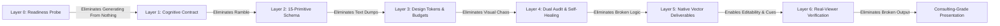

<div align="center">

# undoPPT Design Philosophy & Architecture Synergy Whitepaper

[English](DESIGN_PHILOSOPHY.md) | [简体中文](DESIGN_PHILOSOPHY_zh.md)

</div>

> **Version**: v3.8.0  
> **Positioning**: Next-generation Presentation Deconstruction & Re-engineering Super Agent (undoPPT Super Skill) Core Architectural Standard.  
> **Core Manifesto**: *“A presentation is not an art album, but an audience-centric cognitive reshaping and decision intervention project.”*

---

## 1. Industry Dilemma: Why Traditional Approaches Fail at Presentations

In modern productivity and software engineering, crafting high-stakes professional presentations has historically been trapped between two flawed extremes:

```text
┌───────────────────────────────────────────┐     ┌───────────────────────────────────────────┐
│     Extreme Route A: Pure AI Agent / LLM  │     │ Extreme Route B: Legacy Template / Rules  │
├───────────────────────────────────────────┤     ├───────────────────────────────────────────┤
│ ❌ Incapable of calculating coordinates   │     │ ❌ Static placeholder fills, lifeless     │
│ ❌ Unchecked verbosity, treats PPT as Doc │     │ ❌ Lacks causal narrative progression     │
│ ❌ Outputs raster bitmaps, non-editable   │     │ ❌ Paralyzed outside generic corporate deck│
│ ❌ Cannot generate native vector charts   │     │ ❌ Blind to unstructured business context │
└───────────────────────────────────────────┘     └───────────────────────────────────────────┘
```

To resolve this dilemma, `undoPPT` establishes an architecture based on **Decoupling Soft Cognition from Hard Enforcement**:
- **Large Language Models (LLMs)** excel at high-dimensional semantic reasoning, intent discernment, and strategic consulting, but are fundamentally unreliable at calculating pixel coordinates and enforcing physical layout geometry.
- **Deterministic Engineering Engines** excel at AST template decompilation, geometric math, native vector chart compilation, and rule-based QA, but lack empathy for audience psychology and narrative flow.

Therefore, `undoPPT` defines an explicit, uncompromising separation of concerns between the two layers.

---

## 2. Division of Responsibility Matrix: Agent vs. Skill

```text
                ┌─────────────────────────────────────────────────────────┐
                │                     AI AGENT (Brain)                    │
                │   • Cognitive Contract Probe (Q1-Q4)                    │
                │   • 6-Scenario Archetype Routing                        │
                │   • Fact Ingestion & Entity Extraction                  │
                │   • 15-Primitive Narrative Composition (blueprint.json) │
                │   • Human-in-the-Loop Intent Alignment & Reflection     │
                └───────────────────────────┬─────────────────────────────┘
                                            │ Delivery Protocol: blueprint.json
                                            ▼
                ┌─────────────────────────────────────────────────────────┐
                │                 undoPPT SKILL (Engine)                  │
                │   • Master Template AST Decompilation (Undo Engine)     │
                │   • 10-Dimension Dual Cognitive Quality Auditing        │
                │   • 15 Native Vector Layout Renderers (PPTX & HTML)     │
                │   • Geometry Calculation & Design Token Enforcement     │
                │   • Sub-10ms SHA-256 Fingerprint & AST Diff Sensing     │
                └─────────────────────────────────────────────────────────┘
```

### 2.1 What is the AI Agent Responsible For? (Cognitive Core, Chief Editor & Strategic Consultant)
The Agent handles high-freedom, context-heavy cognitive tasks that demand deep semantic understanding:

1. **Cognitive Contract Probe (Q1–Q4)**:
   - Rather than conducting an interrogative questionnaire, the Agent acts as a senior management consultant to clarify four cognitive pillars:
     - **Q1 Core Message**: Stripping away noise, what is the single central thesis (Core Thesis)?
     - **Q2 Audience Profile & Stance**: Who is the audience, what risks do they fear, and what do they prioritize?
     - **Q3 Knowledge Delta & Blindspots**: What does the audience already know (Baseline) vs. what critical blindspots and pain points do they have (Knowledge Delta)?
     - **Q4 Final Target Action**: After the presentation, what should the audience understand, believe, and immediately decide or execute (Act)?
2. **Scenario Archetype Classification & Routing**:
   - Intelligently recognizes 6 universal scenario archetypes (`strategic_planning`, `tech_architecture`, `product_pitch`, `personal_resume`, `education_training`, `general_informative`) to align with audience expectations.
3. **Fact Ingestion & 15-Primitive Blueprint Composition**:
   - Distills unstructured text (`--input-doc`) and conversation history into a strictly typed `blueprint.json`;
   - Ensures each slide features:
     - **Action Titles**: Replaces passive titles with conclusion-first claims ("Pain Point: ..." or "Impact: ...");
     - **Narrative Arc**: Sequences slides through `hook ➔ conflict ➔ breakthrough ➔ evidence ➔ progression ➔ call_to_action`;
     - **Explicit Causal Transitions**: Embeds transitional conjunctions between slides to eliminate isolated information silos;
     - **Single Slide Responsibility (Mission)**: Each slide fulfills exactly one cognitive objective;
     - **Smoking Gun Evidence**: Anchors claims with quantitative metrics (percentages, ratios, latency) or pedagogical case studies.
4. **Human-in-the-Loop Alignment & Reflection**:
   - When human experts edit files locally, the Agent uses diff analysis to infer user intent and adapts subsequent rounds cooperatively.

---

### 2.2 What is the undoPPT Skill Engine Responsible For? (Hard Execution Foundation, Geometry & Quality Gates)
The Skill engine acts as an automated precision typesetting pipeline and independent quality inspector:

1. **Template Deconstruction (Undo Engine)**:
   - Reads the template's real theme (colour scheme, master background and colour map, theme fonts including the East Asian font) to build the palette, the `dark` / `light` mode and the typography; the brand colour is never rewritten;
   - Traverses Slide Masters and Layouts to extract coordinates (in inches) and relative grid proportions for `Title`, `Body`, `Subtitle`, and `Footer` placeholders;
   - Exports embedded high-resolution raster images and vector logos to `.undoppt/assets/`.
2. **Design Token Enforcement & Content Budgets**:
   - Centralizes palettes, secondary colors, contrasting surface tones, border radii, and typographic hierarchies;
   - Enforces content budget limits (e.g., cards ≤ 4, architecture layers ≤ 4, table rows ≤ 8, chart categories ≤ 8).
3. **100% Native Dual-Format Vector Physical Rendering (PPTX & HTML Builders)**:
   - **Zero Bitmaps**: Assembles vector shapes, cards, badges, and text frames using `python-pptx`;
   - **Native Editable Charts**: Uses `CategoryChartData` for clustered columns, lines, and pie charts. Users can double-click charts in PowerPoint or Keynote to modify underlying spreadsheet values directly;
   - **Formatted Data Tables**: Automatically calculates column widths, cell paddings, and alternating zebra stripes;
   - **Automated Speaker Notes Injection**: Writes slide missions, rhetorical transitions, and conversational talking points into PowerPoint Speaker Notes;
   - **Single-File Standalone HTML**: Compiles self-contained HTML with Tailwind CSS, full-screen presentation mode, and a slide-out Cognitive Inspector drawer triggered by the `N` key.
4. **10-Dimension Dual Cognitive Quality Auditor (Content & Semantic Auditors)**:
   - Evaluates blueprints independently of the LLM: verifies structural redlines, rhetorical transitions, thesis centroid alignment, empirical evidence weights, evidence budget and the provenance of every figure.
5. **Readiness Probe and Real-Viewer Verification**:
   - Before authoring, `probe` reports what is still unknown and the questions to ask; after building, `render-check` renders in PowerPoint and Chrome and reports what a viewer would see.
6. **Sub-10ms Always-in-Sync Watcher**:
   - Uses SHA-256 fingerprinting to detect external edits in `<10ms` and generates semantic AST diffs.

---

## 3. Why This Design? (Core Principles & Architectural Tradeoffs)

### Principle 1: Soft Cognition vs. Hard Enforcement
Large Language Models are **Thinkers**, not **Geometric Renderers**.  
Prompting an LLM to generate raw PPTX XML or guess pixel coordinates inevitably yields overflowing text, overlapping bounding boxes, and visual breakdown. `undoPPT` introduces the **15-Primitive JSON Blueprint** as an immutable contract. The Agent produces structured data; the Skill engine mounts it onto a coordinate grid deterministically.

### Principle 2: Structure Forces Brevity
LLMs have an inherent tendency to output expansive walls of text when unconstrained.  
`undoPPT` provides **zero free-form text layouts**. The engine offers only 15 high-fidelity infographic primitives (Bento cards, process flows, structured tables, vector charts, etc.), each with strict schema constraints (e.g., Bento requires 2–4 cards, each with tag/title/desc/bullets). **The rigidity of the layout primitives forces the Agent to distill ideas into crisp, high-density insights.**

### Principle 3: Always Preserve Human Intervention Agency (Always-in-Sync)
Traditional AI presentation tools operate as one-way black boxes: once a user edits a generated slide, AI iteration breaks, and regenerating overwrites all manual refinements.  
`undoPPT` treats the human expert as the ultimate decision-maker. Native vector shapes enable unconstrained manual adjustments in Office/Keynote, while the Sync Watcher senses modifications in milliseconds to keep the human and AI in lockstep.

### Principle 4: Truth-in-Evidence & Anti-Buzzword Discipline
A critical failure of AI-generated content is hiding conceptual vacuum behind pompous buzzwords ("不仅是X更是Y", "closed-loop flywheels", "5 battlefronts").  
`undoPPT` enforces an **uncompromising anti-buzzword discipline and truth-in-evidence standard**:
- **Deterministic Blacklist Interception**: Automated regex filtering blocks empty jargon and formulaic AI clichés;
- **Empirical Rigor (v3.7)**: Disallow fabricated benchmarks or fake precision. Every number can carry a `source` and a `status` (`verified` / `estimate` / `illustrative` / `todo`); a figure with no source is marked **待核** on the slide, in the speaker notes and in the inspector, and `build --final` refuses to build while any remain. `ingest` and `cite` carry origins (`file:line`) from a document into the blueprint, and never credit a number that has none;
- **6 Archetype Red Lines**: Tech architecture mandates latency distributions (P50/P99) and rollback gates; product decks mandate unit economics; strategic plans require explicit not-to-do lists.

### Principle 5: Motion as Cognitive Pacing (Cognitive Restraint)
Presentation animation commonly degrades into circus-like acrobatics or vanishes entirely into lifeless static cards.  
`undoPPT` mandates that **motion exists solely to guide audience attention and pace cognitive disclosure**:
- **Restrained Transitions**: Subtle slide transitions (`fade` / `push`) rather than distracting rotations or acrobatics;
- **Off by default, three types when on (v3.8)**: `reveal` (one idea per click), `contrast` (the alternatives first, then the recommended one) and `build` (data arrives piece by piece). Each exists for a reason in the telling; everything decorative is gone. A deck for reading gets none;
- **Proven in a real viewer**: the animation tree follows what PowerPoint itself writes, and `render-check` asks PowerPoint how many shapes it recognises. (From v3.3 to v3.7 the tree was one PowerPoint did not recognise at all, which no test of the file alone could have shown.)

### Principle 6: Semantic Kinetic Physics
Legacy AI tools force LLMs to guess bounding-box coordinates and hardcode flight paths for every button and textbox.  
`undoPPT` establishes that **topology determines grouping and the narrative arc sets the pace**:
- The engine groups a slide's shapes into click steps from its geometry (a roadmap node moves with its card, architecture stacks assemble from the bottom, a highlighted card arrives last), and animation durations follow the narrative arc;
- The AI Agent expends zero tokens on micro-coordinates. In the HTML deck, count-up and flowing-pulse effects are decorative and run only in narrative mode.

### Principle 7: Elevating Static Slideware to an Active Decision Sandbox
The fatal vulnerability of traditional presentations is instant collapse when an executive questions hypothetical parameters.  
`undoPPT` transforms standalone HTML decks into an **Active Decision Sandbox**:
- Interactive scenario tabs (Conservative / Baseline / Aggressive) and sensitivity sliders recompute chart trajectories and KPIs dynamically in real-time;
- Clickable architecture drilldowns pop up SLA boundaries and failure domains;
- Equips speakers with a **Live Presenter HUD** (`P` key) featuring a Cognitive Radar, Transition Teleprompter, and an Objection & Defense Playbook.

### Principle 8: Decision-Ready Closing & Rigorous Multi-Dimensional Benchmarking
Presentations delivered to leadership or review committees must never exist to showcase author effort; their sole legitimate purpose is to **catalyze high-quality, low-friction management decisions**:
- **Decision-Ready Ask (`DECISION_ASK_MISSING`)**: Decks must culminate in a structured decision closing (comparative trade-off matrix, clear recommendation, and explicit sign-off items). In HTML decks, interactive checkboxes allow executives to register approvals during live reviews;
- **3-Way Reference Frame Benchmarking (`BENCHMARK_UNBALANCED`)**: Prohibits superficial "all-win vs all-lose" competitor comparisons. Benchmarks must establish a credible 3-way coordinate system (Industry Leader Benchmark vs Direct Competitor vs Cost of In-House Status Quo), honestly detailing migration friction, cognitive costs, and scenario boundaries.

### Principle 9: Authentic Career Attribution & Multi-Scenario Depth
In talent reviews, project debriefs, and specialized corporate decks, presenters must break through reviewer skepticism with undeniable rigor:
- **Net Incremental Yield over Market Tailwinds (`PROMOTION_LAUNDRY_LIST`)**: Prohibits packaging organizational baseline growth as individual sole credit. Enforces deep STAR causality to isolate and verify the individual's net incremental contribution;
- **Methodological Elevation over Task Dumps**: Demands extracting reusable system architectures, SOPs, and governance standards from single-event problem solving;
- **12 Enterprise JTBD Mastery**: Tailors cognitive probes to the exact Job-to-be-Done across 12 distinct enterprise operational scenarios (Project Charters, Annual Strategy/OKRs, QBRs, Cross-Team Alignment, Headcount/Budget Reviews, RFCs, Post-Mortems, GTM Releases, RFP Bidding, Promotion Reviews, Tech Talks, and All-Hands Rallies).


---


### Principle 10: Ask Before You Write (v3.6)
An audit score cannot tell a deck built from real material from one built from nothing: "帮我做一份关于 AI 的汇报" still scored 91.7. The quality gate therefore sits **upstream**:
- `cli.py probe` checks the four contract slots (thesis, audience, knowledge gap, decision) and the facts each scenario needs, and returns the questions to ask. Audience and decision are blocking. Not enough information means no generation;
- A page exists only if the evidence for it does: `docs/scenario_outlines.md` lists, for each of the 12 scenarios, what every page needs, and `THIN_CONTENT` / `EVIDENCE_BUDGET` flag pages whose content cannot carry their layout.

### Principle 11: Trust the Real Viewer, Not the File (v3.5, v3.8)
Three promises in this project's own README turned out false the first time they were checked in PowerPoint and Chrome: `undo` returned the same default for every template, the animations were recognised as none, and parts of the HTML needed a network. Checking the file proves nothing about what a viewer shows. So:
- `cli.py render-check` renders in PowerPoint and Chrome and reports what it finds (overflow, empty bands, low contrast, animations PowerPoint does not recognise);
- Text must reach WCAG contrast against the fill actually behind it, and a brand colour used as a fill is never rewritten; the text on it adapts instead.

## 4. Guaranteeing Quality: The Layered Certainty Closed-Loop Framework

`undoPPT` incorporates a **layered Quality Assurance Closed-Loop** from user input to final delivery. Layers 1 to 5 are the original five; v3.6 added a readiness gate in front (Layer 0) and v3.5/v3.8 a real-viewer check behind (Layer 6):


```mermaid
flowchart LR
    Z[Layer 0: Readiness Probe] -->|Eliminates Generating From Nothing| A[Layer 1: Cognitive Contract]
    A -->|Eliminates Ramble| B[Layer 2: 15-Primitive Schema]
    B -->|Eliminates Text Dumps| C[Layer 3: Design Tokens & Budgets]
    C -->|Eliminates Visual Chaos| D[Layer 4: Dual Audit & Self-Healing]
    D -->|Eliminates Broken Logic| E[Layer 5: Native Vector Deliverables]
    E -->|Enables Editability & Cues| V[Layer 6: Real-Viewer Verification]
    V -->|Eliminates Broken Output| F[Consulting-Grade Presentation]
```

### Layer 0: Readiness Probe — Prevents Generating From Nothing
- `cli.py probe` runs before any slide is written and returns what is still unknown, as questions to ask; audience and decision are blocking.

### Layer 1: Cognitive Contract First — Prevents Off-Topic Rambling
- Adheres to Q1–Q4 probes before any generation starts;
- The **Thesis Centroid Drift Algorithm** checks the semantic intersection between slide keywords and the top-level `core_thesis`, flagging slides that drift away from the core goal.

### Layer 2: 15-Primitive Strong Type Constraint — Prevents Wall-of-Text Slides
- Every slide must conform to one of the 15 standard layout schemas;
- Mandates `action_title` (conclusion-first), `mission` (single responsibility), and `transition` (causal bridge);
- Eliminates meaningless decorative clutter in favor of structured evidence.

### Layer 3: Design Tokens Penetration — Guarantees Visual Cohesion
- Controls palettes, radii, and typography using master templates or preset themes (`modern_bento`, `consulting_minimalist`, `tech_keynote`, `enterprise_architecture`). `undo` reads a template's real theme (colour scheme, master background, fonts) rather than guessing from slides (v3.8);
- Contrast and size are guaranteed whatever the tokens say: text is repaired to WCAG 4.5:1 against the fill behind it, and text below 12pt is raised where the card has room;
- Changing brand themes dynamically updates the presentation without requiring semantic edits in the blueprint.

### Layer 4: 10-Dimension Dual Auditing & Self-Correction Loop — Automated Pre-Delivery QA
Before rendering, blueprints pass through `cli.py audit`:
- **Structural Constraints**: Verifies card counts, architecture layers, table dimensions, and headline phrasing;
- **Evidence and Provenance (v3.6, v3.7)**: `THIN_CONTENT`, `EVIDENCE_BUDGET`, `UNSOURCED_FIGURES`, `EVIDENCE_TODO`; banned words come with a concrete rewrite;
- **Semantic Rhetoric**: Evaluates causal, contrast, and breakthrough conjunctions, checks for hard evidence (percentages, metrics, case studies), and confirms audience objection resolution;
- **Self-Correction Refinement Loop**: If the audit score drops below 85, the engine automatically patches weaknesses until the blueprint achieves an excellent rating.

### Layer 5: Native Vector Deliverables & Speaker Notes Injection — Real-World Usability
- **Fully Editable**: 100% vector shapes, tables, and charts editable directly in PowerPoint and Keynote without third-party plugins;
- **Presentation Safety Net**: Slide missions, causal transition prompts, conversational talking points and the sources of every figure are embedded into PowerPoint Speaker Notes, enabling confident delivery;
- **Offline HTML**: the standalone HTML inlines its runtime and works with no network (v3.5).

### Layer 6: Real-Viewer Verification — Prevents Output That Only Looks Right in the File
- `cli.py render-check` renders the PPTX in PowerPoint (or LibreOffice) and the HTML in Chrome at desktop and phone widths, and asks PowerPoint how many shapes it recognises as animated;
- A static layout lint (overflow, overlaps, wrapped titles, low contrast) runs on every `build` and needs no renderer.

---

## 5. Summary

Within `undoPPT`:
- **The AI Agent is the Strategist and Screenwriter**, analyzing audience mindsets, pacing narrative flow, and establishing rigorous logic;
- **The Skill Engine is the Director and Stage Builder**, executing template replication, primitive assembly, quality auditing, and physical rendering with engineering precision.

This collaboration transforms presentation authoring from a hit-or-miss generative experiment into an **audited, deterministic cognitive engineering pipeline**.
