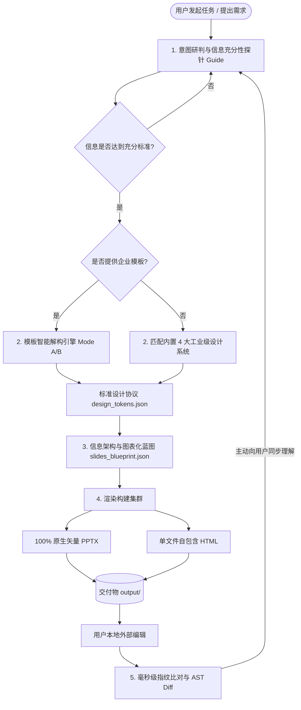

# undoPPT (演示文稿智能解构与重构超级智能体)

[](CHANGELOG.md)
[]()
[]()
[]()

> **“认知契约（Contract）、解构母版（Undo）、图表化重构（Redo）、单文件极简交付（Zero-friction Delivery）、时刻与用户并肩（Always-in-Sync）”**

`undoPPT` 是为 Google Antigravity、Claude Code、Cursor 等全生态 AI Agent 打造的新一代演示文稿超级 Skill 与自动化工程引擎。彻底终结传统 AI 生成 PPT **“通篇堆字、版面混乱、无法吸收企业母版、生成物不可二次编辑、逻辑因果断裂、人机交互单向割裂”** 的核心痛点。

---

## 🧠 核心升级：10 维内容质量动力学体系 (Content Dynamics & Quality Protocol)

在专业商业、咨询与技术架构场景下，**PPT 的本质不是美术画册，而是“以受众为中心的认知重塑与决策干预工程”**。`undoPPT v1.1.0` 将决定 PPT 内容质量的 10 大核心问题工程化融入工作流中：

```text
┌─────────────────────────────────────────────────────────────────────────────┐
│ 1. 认知基座 (Cognitive Contract)                                             │
│    • Q1: 我想表达什么？(主旨唯一性 / Core Message)                           │
│    • Q2: 我的对象是谁？(受众画像与立场偏好 / Audience Profile)               │
│    • Q3: 对方知道什么、不知道什么？(认知差与盲区痛点 / Knowledge Delta)       │
│    • Q4: 希望对方看完后理解什么、相信什么、做什么？(行动转化闭环 / Outcomes) │
├─────────────────────────────────────────────────────────────────────────────┤
│ 2. 全局叙事 (Narrative Dynamics)                                            │
│    • Q5: 演示按什么节奏展开？(叙事弧线: Hook → Conflict → Breakthrough...)  │
│    • Q10: 页面之间如何形成因果、冲突、递进、转折与结论？(页间推演语法)       │
├─────────────────────────────────────────────────────────────────────────────┤
│ 3. 单页切片 (Slide Slicing & Budget)                                        │
│    • Q6: 每一页到底承担什么任务？(单页使命纯粹度 / Single Responsibility)    │
│    • Q7: 一页应该放多少信息？(信息容量预算红线 / Content Budget)            │
│    • Q8: 哪些信息先出现、哪些延后？(行动结论标题先行 / Action Titles)         │
│    • Q9: 哪些是核心证据、哪些只是补充？(铁证突出与次级降噪 / Proof vs Note)  │
└─────────────────────────────────────────────────────────────────────────────┘
```

- 💡 **自动化内容审计 (`cli.py audit`)**：内置 10 维规则审计器，对蓝图信息密度超标、中性被动标题、因果链缺失等问题实时评分并给出整改建议。
- 🎙️ **PPTX 原生演讲备注注入**：单页使命（Mission）、承上启下连词（Transition）与核心证据（Core Evidence）自动编译进 PowerPoint Speaker Notes，助力脱稿演讲。
- 🔍 **HTML 认知动力学抽屉 (`N` 键)**：在单文件 HTML 演示文稿中按键盘 `N` 键，随时调出当前页的推演逻辑与论据层级。

---

## ⚡ 30 秒开始 (Quickstart)

```bash
npx skills add https://github.com/kts-kris/undoPPT --skill undo-ppt
```

也可以直接把这段话发给有 shell 权限的 AI Agent：

```text
帮我安装 undo-ppt。请把 https://github.com/kts-kris/undoPPT 克隆到 ~/.gemini/config/skills/undo-ppt（如果是 Claude Code 则克隆到 ~/.claude/skills/undo-ppt）
```

已经安装过的话，用这段话更新：

```text
帮我更新 undo-ppt。请进入 ~/.gemini/config/skills/undo-ppt 执行 git pull，然后告诉我当前最新提交
```

**安装后直接对 Agent 说：**

> “帮我基于这个模板做一份企业级 AI 战略规划汇报，控制在 6 页左右，包含产品技术架构图和关键 KPI 数据。”

**也可以试这些高阶请求：**
- *“学习我给的这个公司 PPT 模板的设计规范，提取色板与版式，后续页面全部严格遵循它。”*
- *“帮我把这份微服务设计文档做成高保真产品技术堆叠架构图 PPT。”*
- *“我在本地修改了刚才生成的 PPT 第 3 页，请检查我的修改并保持一致继续生成后续页面。”*
- *“生成一份高动效单文件 HTML 演示文稿，方便我在大会上全屏演讲。”*

---

## 🌟 四大超级能力 (Super Capabilities)

### 1. 模板智能解构引擎 (Dual-Mode Deconstruction Engine)
- **模式 A（原生母版 AST 解析）**：基于 `python-pptx` 深度遍历 Slide Masters、版式槽位、配色方案、字体阶梯与安全边距，将用户的 PPTX 模板精准提取为强一致性的 `design_tokens.json`，确保输出完全符合用户预期的演示文稿。
- **模式 B（视觉启发式解析）**：针对散装样张或风格参考图，通过视觉启发式规则将色彩配比、阴影、卡片圆角标准化为统一协议。
- **规范绝对穿透**：一旦标准确立，全任务周期不可篡改地统领所有页面的生成排版。

### 2. 六大原生图元组件库 (Infographic Primitives)
拒绝大段无聊文本，内置 6 大工业级图表化组件元语：
- 🏗️ **产品/技术架构堆叠图 (Architecture Stacks)**：分层底板、微服务组件卡片、分类标签。
- 🍱 **Bento 多栏对比卡片 (Bento Grid Cards)**：2/3/4 栏对比、高亮方案框、要点列表。
- 📊 **KPI 核心指标大字报 (Metric Spotlight)**：超大字体数值、同环比标签、下钻说明。
- ⏱️ **横向推进时间轴与里程碑 (Timeline Roadmap)**：节点圆环、连接轴线、阶段交付清单。
- 🎯 **2x2 战略矩阵与象限 (Matrix)**：多维象限分布与业务评估。
- 🏁 **收官要点速览 (Key Takeaways)**：胶囊编号卡片与决策建议。

### 3. 双端极简交付 (Dual-Format Delivery)
- **PowerPoint PPTX**：100% 原生矢量形状与独立文本框，可在 Microsoft PowerPoint / Apple Keynote 中自由二次编辑，**绝不贴图**。
- **单文件自包含 HTML**：将演示文稿打包为单个 `.html` 文件，内置精美排版、键盘导航（←/→/Space/F 全屏）、进度条，**双击即播，零依赖，极度易于分发**。

### 4. 毫秒级双向协同感知 (Always-in-Sync)
- 每一轮对话伊始，优先运行 **Sync Watcher**，在 `<10ms` 内完成 SHA-256 指纹比对。
- 若用户在外部对 PPTX 进行了手动修改（如调整标题、删减节点、微调颜色），智能体自动生成 AST 差异分析，并在回复开始前主动告知用户：“*检测到您在本地修改了第 3 页，已同步更新意图...*”，真正实现人机并肩共创。

---

## 🏗️ 系统拓扑架构



---

## 📁 目录结构

```text
undoPPT/
├── .agents/skills/undo-ppt/         # Antigravity 工作区 Skill 注册目录
│   └── SKILL.md                    # 超级 Skill 主指令规范与 SOP
├── core/                           # 核心 Python 自动化引擎
│   ├── __init__.py                 # 版本号导出 (1.1.0)
│   ├── content_auditor.py          # 10 维认知质量与叙事动力学审计器
│   ├── undo_engine.py              # PPTX 模板解析解构器 (Mode A)
│   ├── vision_extractor.py         # 视觉启发式解析器 (Mode B)
│   ├── pptx_builder.py             # 100% 原生矢量 PPTX 构建器 (含 Speaker Notes 注入)
│   ├── html_builder.py             # 单文件自包含 HTML 演示编译器 (含 N 键认知抽屉)
│   └── sync_watcher.py             # 毫秒级指纹追踪与语义 AST 差异对比器
├── presets/                        # 4 大工业级预设设计系统 (含 content_budget 预算规则)
│   ├── modern_bento.json           # 现代企业 Bento 卡片 (默认)
│   ├── consulting_minimalist.json  # 顶级战略咨询高密度极简
│   ├── tech_keynote.json           # 科技暗黑大屏展演
│   └── enterprise_architecture.json# 架构工程实战容器
├── tests/                          # 自动化单元与回归测试套件
│   └── test_engine.py
├── output/                         # 最终交付物目录
│   ├── presentation.pptx           # 可二次编辑的 PPTX (含备注)
│   └── presentation.html           # 单文件自包含 HTML (含认知抽屉)
├── .undoppt/                       # 内部元数据缓存 (tokens, blueprint, sync)
├── cli.py                          # 统一命令行交互入口 (undo / build / audit / sync / demo)
├── README.md                       # 本说明文档
└── CHANGELOG.md                    # 语义化版本变更记录
```

---

## 🚀 快速上手 (CLI Quickstart)

### 1. 环境依赖
仅需 Python 3.10+ 及 `python-pptx`：
```bash
pip install python-pptx
```

### 2. 一键运行端到端演示 (Demo)
运行内置的企业级 Agentic AI 方案生成演示（包含认知审计、双端编译与指纹建档）：
```bash
python3 cli.py demo
```
输出：
- `output/presentation.pptx`：完全可编辑的 6 页矢量幻灯片，每页备注栏包含单页使命与连词。
- `output/presentation.html`：双击即可在浏览器全屏播放的动态演示文稿，按 `N` 键开启认知动力学抽屉。

### 3. 内容质量与认知动力学审计 (Audit)
在生成前对蓝图进行严格的 10 维质量审计（检查信息密度超限、行动标题缺失、因果断裂等）：
```bash
python3 cli.py audit --blueprint .undoppt/blueprint.json
```

### 4. 解析提取用户模板 (Undo)
将任意已有的企业 PPTX 模板解构为标准规范，确保生成结果完全符合模板风格：
```bash
python3 cli.py undo --template /path/to/company_template.pptx --out .undoppt/design_tokens.json
```

### 5. 基于蓝图与规范渲染 (Build)
```bash
python3 cli.py build --blueprint .undoppt/blueprint.json --tokens .undoppt/design_tokens.json --format all
```

### 6. 毫秒级协同感知与 Diff 检查 (Sync)
当您在本地用 PowerPoint 或 Keynote 修改了交付物后，检查改动：
```bash
python3 cli.py sync --target output/presentation.pptx
```

---

## 🤖 在 Antigravity 中使用 undoPPT 超级 Skill

本项目已在以下两个层级完成 Skill 自动注册：
1. **工作区层级**：`.agents/skills/undo-ppt/SKILL.md`
2. **全局用户层级**：`~/.gemini/config/skills/undo-ppt/SKILL.md`

在任意对话中，只需自然表达您的 PPT 诉求即可触发：
> *“帮我准备一份面向管理层的企业级 AI 战略规划汇报，我有一个公司的模板 PPT。”*

Skill 会自动进入 **Rhythm A 深度引导流程**：
1. **深度探针**：主动询问核心业务痛点、受众层级，并提醒提供关键数据；
2. **模板解构**：接收您的模板并输出色彩与版面规范；
3. **蓝图确认**：展示每页的图表化元语规划（如哪一页用架构图、哪一页用 KPI 大字报）；
4. **双模交付**：交付 PPTX + 单文件 HTML；
5. **实时同步**：感知您的每一次本地手动调整并持续保持同频！

---

## 🧪 自动化测试验证

运行单元与集成测试套件：
```bash
python3 -m unittest discover -s tests -v
```

---

## 📄 License & 版本演进

- 遵循 **MIT License** 开放许可。
- 遵循 [Semantic Versioning 2.0.0](https://semver.org/spec/v2.0.0.html) 规范，详见 [CHANGELOG.md](CHANGELOG.md)。
