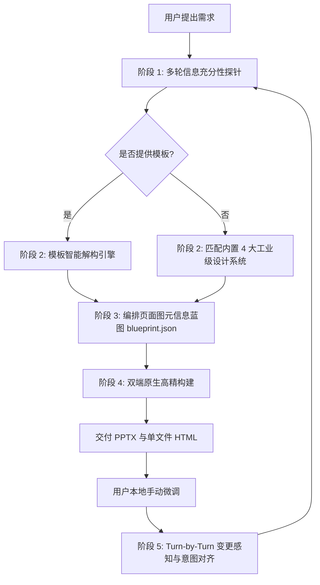

# undoPPT: Presentation Deconstruction & Intelligent Re-engineering Super Skill

`undoPPT` 是一个工业级智能演示文稿解构与重构引擎。它深度解析模板母版与规范，以信息图元重塑内容，支持双向协同感知，交付 100% 可编辑的原生矢量 PPTX 与零依赖单文件 HTML。

---

## 1. 核心运行原则 (Core Operating Principles)

1. **信息充分性第一原则（Sufficiency First）**
   - 严禁在信息贫血时仓促生成。
   - 若用户输入过于简略，坚定执行多轮引导探针（Rhythm A）：挖掘演讲场景、受众定位、核心业务数据、架构层级与痛点指标。
   - 针对企业汇报，主动提醒用户提供内部材料、产品文档或关键业务指标。

2. **模板规范强穿透（Template Dominance）**
   - 优先询问用户是否有企业或专属 `.pptx` 模板。
   - 用户提供模板时，调用解构引擎深度遍历母版、调色板与字体阶梯，输出 `design_tokens.json`。
   - 解析模板的目的就是为了输出**完全符合用户预期的演示文稿**，该标准全生命周期统领所有后续生成。

3. **图表化元语重构（Infographic Primitives）**
   - 坚决拒绝通篇大段文字堆砌，每一页必须映射为 6 大高阶信息图元之一：
     - `cover`: 封面大卡片，包含分类标头、主副标题、作者/日期元数据。
     - `architecture_stack`: 产品与技术架构堆叠图（多层容器、微服务模块卡片、层级徽章）。
     - `bento_cards`: Bento 网格对比卡片（2/3/4 栏对比、高亮卡片、标签列表）。
     - `metric_spotlight`: KPI 核心数据大字报（DIN 大字号、同环比标签、下钻说明）。
     - `timeline`: 演进路线与横向时间轴（节点圆环、连接线、阶段里程碑清单）。
     - `summary`: 战略结论收官卡片（数字徽章、核心建议）。

4. **双端极简交付（Zero-Friction Dual Delivery）**
   - **PPTX**: 100% 原生矢量形状与独立文本框，可在 Microsoft PowerPoint / Apple Keynote 中自由二次编辑，**绝不贴图**。
   - **HTML**: 单文件自包含 HTML（`output/presentation.html`），内置 Tailwind 样式、键盘导航（←/→/Space/F 全屏），**双击即播，零依赖，极度易于分发**。

5. **双向协同感知（Always-in-Sync）**
   - 每一轮对话伊始，必须先运行 Sync Watcher（耗时 `<10ms`）。
   - 若检测到用户在本地对文件进行了微调，优先向用户反馈理解，并融入后续创作。

---

## 2. 标准作业流程 (SOP)



### 阶段 1 · 启动前检查与信息充分性探针
定位 Skill 安装根目录 `<SKILL_ROOT>`（通常为 `~/.gemini/config/skills/undo-ppt`、`~/.claude/skills/undo-ppt` 或工作区中的路径）。

向用户澄清：
1. **演讲场景与受众**（高管汇报、业务复盘、技术方案、产品发布）；
2. **模板来源**：是否有公司现有模板 PPTX，或从 4 大预设中选择：
   - `modern_bento`: 现代企业 Bento 卡片（通用高质感）
   - `consulting_minimalist`: 顶级战略咨询高密度极简（麦肯锡/贝恩风）
   - `tech_keynote`: 科技暗黑大屏展演（开发者峰会）
   - `enterprise_architecture`: 企业架构工程实战（系统设计评审）
3. 索取具体的系统模块名称、核心 KPI 指标或时间节点。

### 阶段 2 · 模板解析提取 (Template Deconstruction)
若用户提供了模板文件：
```bash
python3 "<SKILL_ROOT>/cli.py" undo --template /path/to/template.pptx --out .undoppt/design_tokens.json
```
提炼出色彩方案与版式规则后，向用户展示确认。

### 阶段 3 · 蓝图规划 (Blueprinting)
根据材料规划每页的版式元语，保存至 `.undoppt/blueprint.json`，并与用户确认大纲。

### 阶段 4 · 高精构建 (Build)
运行渲染器交付双端文件：
```bash
python3 "<SKILL_ROOT>/cli.py" build --blueprint .undoppt/blueprint.json --tokens .undoppt/design_tokens.json --format all --out output
```
交付产物：
- `output/presentation.pptx`
- `output/presentation.html`

### 阶段 5 · 协同感知检查 (Sync Watcher)
在后续每轮用户发言开始时：
```bash
python3 "<SKILL_ROOT>/cli.py" sync --target output/presentation.pptx
```
若有改动，在回复开头主动向用户同步：
> *"检测到您在本地修改了第 3 页：调整了标题并微调了架构层级。我已经同步更新意图，接下来的任务将遵循您的改动。"*

---

## 3. CLI 快速调用参考

```bash
# 1. 深度解析模板并提取设计规范
python3 "<SKILL_ROOT>/cli.py" undo --template <template.pptx>

# 2. 基于蓝图与设计规范构建演示文稿
python3 "<SKILL_ROOT>/cli.py" build --blueprint <blueprint.json> --tokens <tokens.json> --format all

# 3. 检查用户本地手动修改
python3 "<SKILL_ROOT>/cli.py" sync --target output/presentation.pptx

# 4. 一键生成企业级端到端实战演示
python3 "<SKILL_ROOT>/cli.py" demo
```
