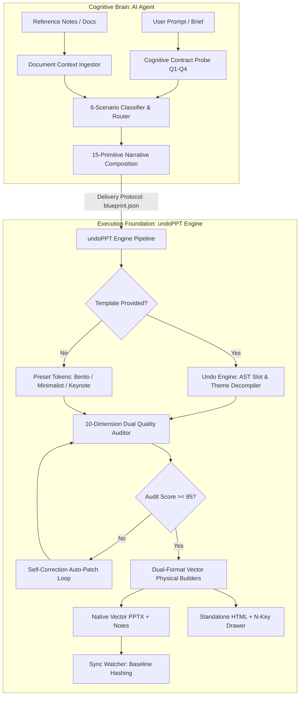

# undoPPT Architecture & Engineering Deep-Dive

This document details the internal architecture, module separation, data flows, and engineering mechanics of the `undoPPT` presentation engine (v3.1.0).

---

## 1. System Philosophy: Decoupled Cognition

Traditional AI presentation tools fail because they conflate two fundamentally distinct operations:
1. **Semantic & Narrative Reasoning** (High-dimensional intent, audience empathy, persuasion logic);
2. **Physical Layout & Coordinate Geometry** (Absolute positioning, line wrapping, contrast luminance, native vector object models).

`undoPPT` decouples these into an explicit client-server model:



---

## 2. Core Modules

### 2.1 `core/cognitive_planner.py`
The autonomous planning engine responsible for transforming unstructured text into structured, audited blueprints.
- **6 Scenario Archetypes**:
  - `strategic_planning`: Emphasizes organizational alignment, 2x2 priority matrices, maturity ladders, and 3-horizons governance.
  - `tech_architecture`: Emphasizes component stacks, decoupled tiers, SLA metrics, and phased rollout roadmaps.
  - `product_pitch`: Emphasizes market pain points, solution bento grids, traction metrics, and funding milestones.
  - `personal_resume`: Emphasizes executive profiles, core competencies, quantifiable impact, and personal commitments.
  - `education_training`: Emphasizes learning goals, conceptual breakdowns, comparative examples, and retention exercises.
  - `general_informative`: Emphasizes executive overviews, operational updates, and next steps.
- **`DocumentContextIngestor`**: Uses domain-agnostic regular expressions and heuristic token extractors to pull out organizational tiers, numbers, metrics (`%`, `x`, `ms`, currency), pain points, and action items from external documents.
- **Self-Correction Refinement Loop**: Evaluates candidate blueprints against structural and semantic rules. If scores fall below 85, the loop patches passive headlines, injects missing causal transitions, and sharpens evidence points.

---

### 2.2 `core/semantic_auditor.py`
Audits the causal cohesion and rhetorical integrity of the presentation.
- **6 Causal Rhetoric Ontologies**:
  - `contrast` (e.g. *However, In contrast, Despite*);
  - `causality` (e.g. *Therefore, Consequently, As a result*);
  - `breakthrough` (e.g. *To solve this, The breakthrough lies in*);
  - `progression` (e.g. *Furthermore, Moving forward, Stepwise*);
  - `evidence` (e.g. *Telemetry proves, Benchmarks indicate*);
  - `action` (e.g. *We recommend, Action required*).
- **Core Thesis Centroid Drift**: Computes semantic overlap between slide keywords and the top-level `core_thesis`. Slides that fail to contribute to the central thesis receive a penalty.
- **Smoking Gun Evidence Weighting**: Rewards slides containing concrete quantitative proof (e.g., percentages, ratios, latencies) and penalizes vacuous slogans.
- **Pluggable LLM Judge Hook**: Offers an optional `llm_judge_fn` interface for hybrid rule-based and model-based qualitative evaluation.

---

### 2.3 `core/content_auditor.py`
Enforces physical layout redlines and content budgets across all 15 layout primitives.
- **Title Voice Check**: Flags passive headlines (e.g., *"Market Overview"*, *"Current Status"*) and mandates action-oriented conclusion titles (e.g., *"Pain Point: Fragmentation drives 80% manual overhead"*).
- **Content Budget Redlines**: Validates card counts (2–4), architecture layers (3–4), table dimensions (≤ 8 rows, ≤ 5 columns), and chart categories (≤ 8).
- **Speaker Notes Verification**: Verifies that slide missions and transitions are populated.
- **Unified Scoring**: Combines structural score (40%) and semantic score (60%) into an overall 100-point rating.

---

### 2.4 `core/undo_engine.py`
The reverse-engineering module for enterprise PowerPoint templates.
- **OpenXML AST Slot Parsing**: Scans `SlideMaster` and `SlideLayout` trees in `.pptx` packages to extract absolute coordinates (`left`, `top`, `width`, `height` in inches) for Title, Body, Subtitle, and Footer placeholders.
- **Canvas Luminance Analysis**: Computes RGB luminance of slide backgrounds and dominant shapes to infer `theme_mode` (`light` vs. `dark`) and selects high-contrast text palettes.
- **Embedded Asset Extraction**: Extracts embedded high-resolution raster images (PNG, JPEG) and vector shapes to `.undoppt/assets/` for brand preservation.

---

### 2.5 `core/pptx_builder.py`
The deterministic PowerPoint generation pipeline powered by `python-pptx`.
- **100% Native Vector Shapes**: Renders geometric containers, rounded cards, and category badges as pure vector shapes (**never rasterized bitmaps**).
- **Native Vector Charts**: Utilizes `CategoryChartData` to generate clustered column, line, and pie charts. Charts remain completely editable via native Office and Keynote spreadsheets.
- **Structured Data Tables**: Automatically calculates column widths, zebra-striped row fills, and contrasting borders.
- **Speaker Notes Stream Injection**: Serializes `mission`, `transition`, and conversational talking points into the slide's underlying `notes_slide` XML part.

---

### 2.6 `core/html_builder.py`
Compiles presentations into a zero-dependency, single-file HTML deliverable.
- **Responsive Embedded Tailwind**: Embeds all necessary CSS styling inline to ensure complete platform independence.
- **Interactive Presentation Controls**: Features keyboard navigation (`←`/`→`/`Space`/`Home`/`End`), full-screen toggle (`F`), slide progress bars, and responsive viewport scaling.
- **Slide-out Cognitive Inspector (`N` Key)**: A persistent drawer that reveals the underlying Cognitive Contract, slide mission, rhetorical transition, and proof hierarchy in real time.

---

### 2.7 `core/sync_watcher.py`
Maintains human-AI pair authoring synchronization.
- **Sub-10ms Fingerprint Verification**: Computes SHA-256 hashes of rendered presentations at startup in under 10 milliseconds.
- **Semantic AST Diff Inspection**: If external edits are detected (such as text modifications in Keynote or PowerPoint), the module parses the modified deck, identifies altered slides, and reports precise textual diffs to the AI Agent.

---

## 3. Presets & Design Tokens

Design tokens are stored as JSON files under `presets/`. They govern palettes, typography, border radii, and density limits:

```json
{
  "theme_name": "Modern Bento",
  "theme_mode": "light",
  "palette": {
    "primary": "#2563EB",
    "secondary": "#0D9488",
    "background": "#F8FAFC",
    "card_bg": "#FFFFFF",
    "text_primary": "#0F172A",
    "text_secondary": "#475569",
    "accent": "#F59E0B"
  },
  "typography": {
    "title": { "font": "Arial", "size_pt": 24, "bold": true },
    "body": { "font": "Calibri", "size_pt": 14, "bold": false }
  },
  "content_budget": {
    "max_cards": 4,
    "max_layers": 4,
    "max_timeline_steps": 4,
    "max_table_rows": 8,
    "max_table_cols": 5
  }
}
```

### Built-in Presets
1. `modern_bento.json`: Clean modern bento grid with cool blue accents and high contrast (default).
2. `consulting_minimalist.json`: High-density monochrome layout tailored for management consulting debriefs.
3. `tech_keynote.json`: High-contrast dark mode palette tailored for tech conferences and keynote stages.
4. `enterprise_architecture.json`: Industrial slate palette tailored for systems engineering and technical reviews.
