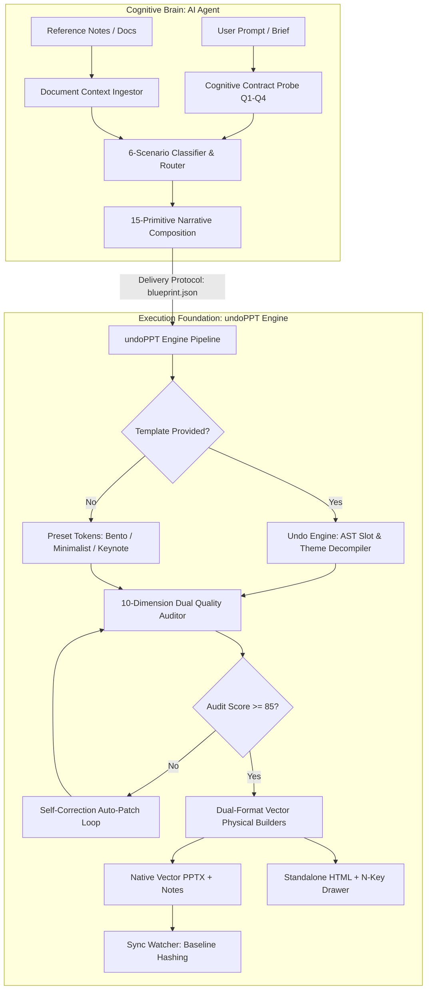

# undoPPT Architecture & Engineering Deep-Dive

This document details the internal architecture, module separation, data flows, and engineering mechanics of the `undoPPT` presentation engine (v3.7.0).

---

## 1. System Philosophy: Decoupled Cognition

Traditional AI presentation tools fail because they conflate two fundamentally distinct operations:
1. **Semantic & Narrative Reasoning** (High-dimensional intent, audience empathy, persuasion logic);
2. **Physical Layout & Coordinate Geometry** (Absolute positioning, line wrapping, contrast luminance, native vector object models).

`undoPPT` decouples these into an explicit client-server model:


```mermaid
flowchart TD
    subgraph CognitiveLayer [Cognitive Brain: AI Agent]
        A[User Prompt / Brief] --> B[Cognitive Contract Probe Q1-Q4]
        C[Reference Notes / Docs] --> D[Document Context Ingestor]
        B --> E[6-Scenario Classifier & Router]
        D --> E
        E --> F[15-Primitive Narrative Composition]
    end

    F -->|Delivery Protocol: blueprint.json| G[undoPPT Engine Pipeline]

    subgraph EngineLayer [Execution Foundation: undoPPT Engine]
        G --> H{Template Provided?}
        H -- Yes --> I[Undo Engine: AST Slot & Theme Decompiler]
        H -- No --> J[Preset Tokens: Bento / Minimalist / Keynote]
        I --> K[10-Dimension Dual Quality Auditor]
        J --> K
        K --> L{Audit Score >= 85?}
        L -- No --> M[Self-Correction Auto-Patch Loop]
        M --> K
        L -- Yes --> N[Dual-Format Vector Physical Builders]
        N --> O1[Native Vector PPTX + Notes]
        N --> O2[Standalone HTML + N-Key Drawer]
        O1 --> P[Sync Watcher: Baseline Hashing]
    end
```

---

## 2. Core Modules

### 2.1 `core/cognitive_planner.py`
The autonomous planning engine responsible for transforming unstructured text into structured, audited blueprints.
- **6 Scenario Archetypes**:
  - `strategic_planning`: Emphasizes organizational alignment, 2x2 priority matrices, maturity ladders, and 3-horizons governance.
  - `tech_architecture`: Emphasizes component stacks, decoupled tiers, SLA metrics, and phased rollout roadmaps.
  - `product_pitch`: Emphasizes market pain points, solution bento grids, traction metrics, and funding milestones.
  - `personal_resume`: Emphasizes executive profiles, core competencies, quantifiable impact, and personal commitments.
  - `education_training`: Emphasizes learning goals, conceptual breakdowns, comparative examples, and retention exercises.
  - `general_informative`: Emphasizes executive overviews, operational updates, and next steps.
- **`DocumentContextIngestor`**: Uses domain-agnostic regular expressions and heuristic token extractors to pull out organizational tiers, numbers, metrics (`%`, `x`, `ms`, currency), pain points, and action items from external documents.
- **Self-Correction Refinement Loop**: Evaluates candidate blueprints against structural and semantic rules. If scores fall below 85, the loop patches passive headlines, injects missing causal transitions, and sharpens evidence points.

---

### 2.2 `core/semantic_auditor.py`
Audits the causal cohesion and rhetorical integrity of the presentation.
- **6 Causal Rhetoric Ontologies**:
  - `contrast` (e.g. *However, In contrast, Despite*);
  - `causality` (e.g. *Therefore, Consequently, As a result*);
  - `breakthrough` (e.g. *To solve this, The breakthrough lies in*);
  - `progression` (e.g. *Furthermore, Moving forward, Stepwise*);
  - `evidence` (e.g. *Telemetry proves, Benchmarks indicate*);
  - `action` (e.g. *We recommend, Action required*).
- **Core Thesis Centroid Drift**: Computes semantic overlap between slide keywords and the top-level `core_thesis`. Slides that fail to contribute to the central thesis receive a penalty.
- **Smoking Gun Evidence Weighting**: Rewards slides containing concrete quantitative proof (e.g., percentages, ratios, latencies) and penalizes vacuous slogans.
- **Pluggable LLM Judge Hook**: Offers an optional `llm_judge_fn` interface for hybrid rule-based and model-based qualitative evaluation.

---

### 2.3 `core/content_auditor.py`
Enforces physical layout redlines and content budgets across all 15 layout primitives.
- **Title Voice Check**: Flags passive headlines (e.g., *"Market Overview"*, *"Current Status"*) and mandates action-oriented conclusion titles (e.g., *"Pain Point: Fragmentation drives 80% manual overhead"*).
- **Content Budget Redlines**: Validates card counts (2–4), architecture layers (3–4), table dimensions (≤ 8 rows, ≤ 5 columns), and chart categories (≤ 8).
- **Speaker Notes Verification**: Verifies that slide missions and transitions are populated.
- **Unified Scoring**: Combines structural score (40%) and semantic score (60%) into an overall 100-point rating.

---

### 2.4 `core/undo_engine.py`
The reverse-engineering module for enterprise PowerPoint templates.
- **OpenXML AST Slot Parsing**: Scans `SlideMaster` and `SlideLayout` trees in `.pptx` packages to extract absolute coordinates (`left`, `top`, `width`, `height` in inches) for Title, Body, Subtitle, and Footer placeholders.
- **Canvas Luminance Analysis**: Computes RGB luminance of slide backgrounds and dominant shapes to infer `theme_mode` (`light` vs. `dark`) and selects high-contrast text palettes.
- **Embedded Asset Extraction**: Extracts embedded high-resolution raster images (PNG, JPEG) and vector shapes to `.undoppt/assets/` for brand preservation.

---

### 2.5 `core/pptx_builder.py`
The deterministic PowerPoint generation pipeline powered by `python-pptx`.
- **100% Native Vector Shapes**: Renders geometric containers, rounded cards, and category badges as pure vector shapes (**never rasterized bitmaps**).
- **Native Vector Charts**: Utilizes `CategoryChartData` to generate clustered column, line, and pie charts. Charts remain completely editable via native Office and Keynote spreadsheets.
- **Structured Data Tables**: Automatically calculates column widths, zebra-striped row fills, and contrasting borders.
- **Speaker Notes Stream Injection**: Serializes `mission`, `transition`, and conversational talking points into the slide's underlying `notes_slide` XML part.

---

### 2.6 `core/html_builder.py`
Compiles presentations into a zero-dependency, single-file HTML deliverable.
- **Responsive Embedded Tailwind**: Embeds all necessary CSS styling inline to ensure complete platform independence.
- **Interactive Presentation Controls**: Features keyboard navigation (`←`/`→`/`Space`/`Home`/`End`), full-screen toggle (`F`), slide progress bars, and responsive viewport scaling.
- **Slide-out Cognitive Inspector (`N` Key)**: A persistent drawer that reveals the underlying Cognitive Contract, slide mission, rhetorical transition, and proof hierarchy in real time.

---

### 2.6.1 `core/layout_fit.py` (v3.5)
A content-adaptive pass the PPTX builder applies to every slide after its renderer runs. The renderers still place shapes at fixed coordinates; this layer measures the text that actually sits in them and adapts:
- **Title fit**: shrinks the header title (down to 22pt) until it fits one line, so it never wraps into the content below. A title that still does not fit drops its subtitle from the slide face.
- **Card radius**: applies the token `card_style.border_radius` instead of python-pptx's default 1/6 of the short side.
- **Font floor**: scales frames whose smallest run is under 12pt (max 1.4x), backing off if the estimated text height would overflow its card. Ovals are skipped because their text area is narrower than the frame.
- **Card fit**: shrinks cards to their text (rows are equalised), scaling sparse text up to 1.3x first. Covers text boxes over cards (`bento_cards`, `metric_spotlight`, `timeline`) and cards that carry their own text (`content_columns`).
- **Vertical balance**: centers the content block in the free space under the header (up to 1.3in).
Text is measured with a heuristic (CJK = 1 em, Latin about 0.55 em); the real-render check is the ground truth.

### 2.6.2 `core/layout_lint.py` (v3.5)
Static geometry lint for built PPTX files: `OUT_OF_BOUNDS`, `TITLE_WRAPS`, `TEXT_OVERFLOW`, `TEXT_CROSSES_SHAPE`, `TEXT_OVERLAP`. It needs no renderer. Against the v3.4 demo it reports 19 findings, all of which were visible in PowerPoint; against v3.5 output it reports none.

### 2.6.3 `core/render_check.py` (v3.5)
Real-render verification. PPTX goes through PowerPoint (macOS) or LibreOffice to PDF, then PNG via `pypdfium2`, then a pixel check for large empty bands. HTML is opened in headless Chrome with `?slide=N&static=1`; in static mode the page freezes animations and writes how far its content extends past the canvas into `data-layout` on `<body>`, which the checker reads with `--dump-dom`.

### 2.6.4 HTML canvas model (v3.5)
The HTML deliverable is a fixed 1340x754 canvas scaled with a CSS transform to fit the viewport (`fitStage`), so layout is identical on every screen. `fitBody` then scales each slide body up to 1.4x to use the free height under the header, and back down if it would overflow. The Tailwind runtime is inlined from `core/vendor/`, so the file has no network dependency.

### 2.6.5 `core/contract_probe.py` (v3.6)
Readiness probe that runs before any slide is written. Reuses the planner's scenario classifier, then checks the four universal contract slots and 3-4 scenario-specific facts per scenario (`SCENARIOS`) against the prompt and optional reference document. Returns a readiness ratio, the blocking slots (audience and decision) and an ordered list of questions for the Agent to ask.

### 2.6.6 `core/blueprint_compat.py` (v3.6)
The Blueprint Specification and the planner use one set of field names for several layouts; the renderers were written against another. Until v3.5 the gap was silent (a `cross_mapping` slide lost 90% of its text; `content_columns` lost every bullet). `normalize_slide` maps the documented fields (`points`, `tag`, `layer/current/target/action`, `horizon/name/kpi`, `step/focus`, `axes`) to the renderers' fields without overriding anything already in the renderer schema. Both builders call it. `tests/test_contract.py::TestTextFidelity` asserts that every string in a blueprint reaches the PPTX and the HTML.

### 2.6.7 Evidence budget (v3.6, in `core/content_auditor.py`)
`THIN_CONTENT_P<n>`: the slide's body text (headers excluded) is shorter than its layout needs, which means the layout is dressing up too little content. `EVIDENCE_BUDGET_P<n>`: a KPI slide where fewer than half the metrics carry a number. Minimum body lengths are set to about half of what the planner's own decks contain. Total deduction is capped at 12 points.

### 2.6.8 `core/provenance.py` and `core/ingest.py` (v3.7)
`provenance.scan_slide` finds the figures on a slide (percentages, multiples, money, durations, counted units; not years, quarters or structural counts), works out which are covered by a `source` (slide-level or nested), and classifies them by `status`. Renderers use `provenance_labels` for the footer and 待核 badge and `notes_block` for the speaker notes; the auditor uses the scan for `UNSOURCED_FIGURES` / `EVIDENCE_TODO` (deduction capped at 10). `ingest.extract_facts` reads Markdown, text and CSV and returns figures with `file:line` or `file:row·column` origins; `provenance.attach_sources` links them to a blueprint conservatively (see CLI reference).

The footer and badge are added after the layout pass (`layout_fit`), so they never shift the content block.

### 2.7 `core/sync_watcher.py`
Maintains human-AI pair authoring synchronization.
- **Sub-10ms Fingerprint Verification**: Computes SHA-256 hashes of rendered presentations at startup in under 10 milliseconds.
- **Semantic AST Diff Inspection**: If external edits are detected (such as text modifications in Keynote or PowerPoint), the module parses the modified deck, identifies altered slides, and reports precise textual diffs to the AI Agent.

---

## 3. Presets & Design Tokens

Design tokens are stored as JSON files under `presets/`. They govern palettes, typography, border radii, and density limits:

```json
{
  "theme_name": "Modern Bento",
  "theme_mode": "light",
  "palette": {
    "primary": "#2563EB",
    "secondary": "#0D9488",
    "background": "#F8FAFC",
    "card_bg": "#FFFFFF",
    "text_primary": "#0F172A",
    "text_secondary": "#475569",
    "accent": "#F59E0B"
  },
  "typography": {
    "title": { "font": "Arial", "size_pt": 24, "bold": true },
    "body": { "font": "Calibri", "size_pt": 14, "bold": false }
  },
  "content_budget": {
    "max_cards": 4,
    "max_layers": 4,
    "max_timeline_steps": 4,
    "max_table_rows": 8,
    "max_table_cols": 5
  }
}
```

### Built-in Presets
1. `modern_bento.json`: Clean modern bento grid with cool blue accents and high contrast (default).
2. `consulting_minimalist.json`: High-density monochrome layout tailored for management consulting debriefs.
3. `tech_keynote.json`: High-contrast dark mode palette tailored for tech conferences and keynote stages.
4. `enterprise_architecture.json`: Industrial slate palette tailored for systems engineering and technical reviews.
