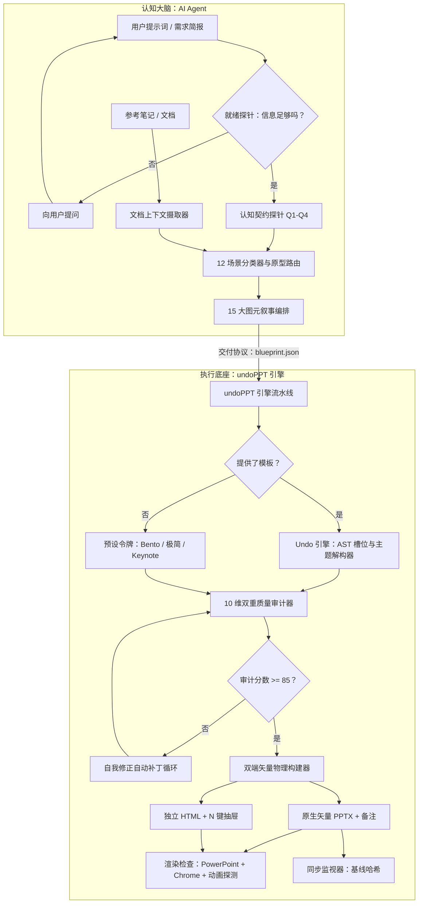

# undoPPT 架构与工程深度解析

> [English](../en/architecture.md) | 简体中文

本文详述 `undoPPT` 演示文稿引擎（v3.8.0）的内部架构、模块划分、数据流与工程机制。

---

## 1. 系统哲学：认知解耦

传统的 AI 演示文稿工具之所以做不好，是因为它们把两件本质不同的事混在了一起：
1. **语义与叙事推理**（高维的意图、对受众的共情、说服逻辑）；
2. **物理版面与坐标几何**（绝对定位、折行、对比度与亮度、原生矢量对象模型）。

`undoPPT` 把它们明确地拆成一个客户端—服务端模型：



---

## 2. 核心模块

### 2.1 `core/cognitive_planner.py`
基于规则的规划引擎，把非结构化文本转成结构化、经过审计的蓝图。

> **定位（v3.6）：兜底作者。** 它能产出结构完整的通用骨架，但自己没有任何洞察：对一个像"做一份关于 AI 的 PPT"这么空的请求，它照样返回 90 多分的审计成绩，而它写出的数字是编造的模板（会在成品里显示为"待核"）。推荐的路径是由 Agent 先提问（`core/contract_probe.py`），再根据用户的真实材料写蓝图。规划器用于快速出草稿，并作为[场景提纲样例](scenario_outlines.md)中叙事线的参照（有测试保证两者一致）。

- **12 个企业场景（v3.4）**：项目立项、年度战略/OKR、QBR、跨团队拉通、人头评审、技术 RFC、故障复盘、GTM 上市、大客户竞标、晋升述职、技术内训、全员大会，每个都锚定在下面某一个原型上。
- **6 个场景原型**：
  - `strategic_planning`：强调组织对齐、2x2 优先级矩阵、成熟度阶梯与三道地平线治理。
  - `tech_architecture`：强调组件栈、解耦分层、SLA 指标与分阶段上线路线图。
  - `product_pitch`：强调市场痛点、方案 Bento 网格、增长指标与融资里程碑。
  - `personal_resume`：强调高管画像、核心能力、可量化影响与个人承诺。
  - `education_training`：强调学习目标、概念拆解、对比示例与巩固练习。
  - `general_informative`：强调高管概览、运营更新与下一步。
- **`DocumentContextIngestor`**：用与领域无关的正则与启发式词元抽取器，从外部文档里抽取组织层级、数字、指标（`%`、`x`、`ms`、货币）、痛点与行动项。
- **自我修正循环**：按结构与语义规则评估候选蓝图。分数低于 85 时，循环会修补被动标题、补上缺失的因果转折、加强实证点。

---

### 2.2 `core/semantic_auditor.py`
审计演示文稿的因果连贯性与修辞完整性。
- **6 类因果修辞本体**：
  - `contrast` 对比（如 *然而、与之相反、尽管*）；
  - `causality` 因果（如 *因此、于是、结果是*）；
  - `breakthrough` 突破（如 *为了解决这个问题、突破点在于*）；
  - `progression` 递进（如 *此外、接下来、分步*）；
  - `evidence` 举证（如 *遥测数据证明、基准测试表明*）；
  - `action` 行动（如 *我们建议、需要行动*）。
- **核心主旨向心度**：计算页面关键词与顶层 `core_thesis` 的语义交集。对核心主旨没有贡献的页面会被扣分。
- **硬证据加权**：奖励含有具体量化证据（百分比、比率、延迟）的页面，惩罚空洞的口号。
- **可插拔的 LLM 裁判钩子**：提供可选的 `llm_judge_fn` 接口，用于规则与模型混合的定性评估。

---

### 2.3 `core/content_auditor.py`
对全部 15 种图元执行物理版面红线与内容预算。
- **标题语态检查**：标出被动标题（如 *"市场概览"*、*"现状"*），要求使用行动导向的结论式标题（如 *"痛点：碎片化带来 80% 的人工开销"*）。
- **内容预算红线**：校验卡片数（2–4）、架构层数（3–4）、表格尺寸（≤ 8 行、≤ 5 列）与图表类目（≤ 8）。
- **演讲备注核验**：核验每页的使命与转折是否已填写。
- **综合评分**：把结构分（50%）与语义分（50%）合成 100 分制总分。（本页早期版本写的是 40/60，代码一直是 50/50。）
- **v3.4 以来新增的规则集**：证据预算（`THIN_CONTENT`、`EVIDENCE_BUDGET`，v3.6）、出处（`UNSOURCED_FIGURES`、`EVIDENCE_TODO`，v3.7）、套话改写建议（v3.7）。

---

### 2.4 `core/undo_engine.py`
企业 PowerPoint 模板的逆向工程模块。
- **OpenXML AST 槽位解析**：扫描 `.pptx` 包中的 `SlideMaster` 与 `SlideLayout` 树，提取标题、正文、副标题、页脚占位符的绝对坐标（`left`、`top`、`width`、`height`，单位英寸）。
- **真实主题读取（v3.8）**：通过 `core/theme_reader.py` 读取模板自己的主题（配色方案、母版背景与颜色映射、主题字体），并据此推出配色、`theme_mode` 与字体。v3.8 之前，这个模块只扫描幻灯片上显式写死的 RGB 填充，而真实模板里没有这些，所以每份模板都返回同一个默认值。文件没有可读主题时，旧的扫描仍作为后备。
- **令牌检查（v3.8）**：抽取出的令牌经过 `core/design_check.py`（对比度、最小字号、层级）；页边距被限制到构建器网格可用的范围。
- **嵌入素材抽取**：把嵌入的高分辨率位图（PNG、JPEG）与矢量形状导出到 `.undoppt/assets/`，保留品牌资产。

---

### 2.5 `core/pptx_builder.py`
基于 `python-pptx` 的确定性 PowerPoint 生成流水线。
- **100% 原生矢量形状**：几何容器、圆角卡片、分类徽标全部渲染为纯矢量形状（**绝不栅格化为位图**）。
- **原生矢量图表**：用 `CategoryChartData` 生成簇状柱形图、折线图与饼图。图表在原生 Office 与 Keynote 的表格里完全可编辑。
- **结构化数据表**：自动计算列宽、斑马纹行填充与对比边框。
- **演讲备注流注入**：把 `mission`、`transition`、口语化的讲稿要点，以及（v3.7）该页的出处与待核数字，序列化进幻灯片底层的 `notes_slide` XML 部件。
- **渲染后处理（v3.5–v3.8）**：每页画完后，`core/layout_fit.py` 适配标题、卡片与字号，加上出处页脚与"待核"徽标，并把文字颜色修复到 WCAG 对比度；之后 `core/motion.py` 再加上可选的叙事动画。

---

### 2.6 `core/html_builder.py`
把演示文稿编译成零依赖的单文件 HTML 交付物。
- **响应式内嵌 Tailwind**：所有需要的 CSS 都内联，保证完全不依赖平台。
- **交互式演示控制**：键盘导航（`←`/`→`/`Space`/`Home`/`End`）、全屏切换（`F`）、页面进度条与响应式视口缩放。
- **滑出式认知检视器（`N` 键）**：常驻抽屉，实时显示底层的认知契约、页面使命、修辞转折与证据层级。

---

### 2.6.1 `core/layout_fit.py`（v3.5）
PPTX 构建器在每页渲染器运行之后施加的内容自适应处理。渲染器仍然把形状放在固定坐标；这一层去量实际放在里面的文字，并据此调整：
- **标题适配**：把页眉标题缩小（最小到 22pt）直到放进一行，使它不会折进下面的内容。仍放不下的标题，会把副标题从页面上拿掉。
- **卡片圆角**：使用令牌 `card_style.border_radius`，而不是 python-pptx 默认的短边的 1/6。
- **字号地板**：把最小文字小于 12pt 的文字框放大（最多 1.4 倍），如果估算的文字高度会溢出卡片就回退。椭圆被跳过，因为它的文字区域比外框窄。
- **卡片适配**：把卡片收缩到贴合文字（同一行等高），之前先把稀疏文字最多放大 1.3 倍。覆盖"文字框叠在卡片上"（`bento_cards`、`metric_spotlight`、`timeline`）与"卡片自带文字"（`content_columns`）两种结构。
- **垂直居中**：把内容块在页眉下方的剩余空间里居中（最多 1.3 英寸）。

文字测量用的是启发式（中文 = 1 em，西文约 0.55 em）；真实渲染检查才是最终依据。

### 2.6.2 `core/layout_lint.py`（v3.5）
对已构建 PPTX 的静态几何 lint：`OUT_OF_BOUNDS`、`TITLE_WRAPS`、`TEXT_OVERFLOW`、`TEXT_CROSSES_SHAPE`、`TEXT_OVERLAP`。不需要渲染器。对 v3.4 的 demo 它报出 19 条发现，每一条在 PowerPoint 里都看得见；对 v3.5 的输出则一条也没有。

### 2.6.3 `core/render_check.py`（v3.5）
真实渲染验证。PPTX 经 PowerPoint（macOS）或 LibreOffice 转 PDF，再用 `pypdfium2` 转 PNG，然后做像素检查找出大块空白带。HTML 在无头 Chrome 里用 `?slide=N&static=1` 打开；静态模式下页面冻结动画，并把内容超出画布多少写进 `<body>` 的 `data-layout`，检查器用 `--dump-dom` 读回。

### 2.6.4 HTML 画布模型（v3.5）
HTML 交付物是一块固定的 1340x754 画布，用 CSS transform 缩放到适配视口（`fitStage`），所以每块屏幕上的版面都一样。`fitBody` 再把每页的正文放大最多 1.4 倍，利用页眉下方的剩余高度，会溢出就缩回。Tailwind 运行时从 `core/vendor/` 内联，所以文件没有任何网络依赖。

### 2.6.5 `core/contract_probe.py`（v3.6）
在写任何一页之前运行的就绪探针。复用规划器的场景分类器，然后把四个通用契约槽位，以及每个场景的 3–4 个场景专属事实（`SCENARIOS`），对着提示词与可选参考文档逐一检查。返回就绪比例、阻塞槽位（受众与决策），以及一份有序的、供 Agent 提问的问题清单。

### 2.6.6 `core/blueprint_compat.py`（v3.6）
蓝图规格书与规划器对若干图元用的是一套字段名，而渲染器是按另一套写的。到 v3.5 为止这个缺口是静默的（`cross_mapping` 页丢掉 90% 的文字；`content_columns` 丢掉所有要点）。`normalize_slide` 把文档里的字段（`points`、`tag`、`layer/current/target/action`、`horizon/name/kpi`、`step/focus`、`axes`）映射成渲染器的字段，不覆盖渲染器格式里已有的任何东西。两个构建器都会调用它。`tests/test_contract.py::TestTextFidelity` 断言蓝图里的每一个字符串都进入了 PPTX 与 HTML。

### 2.6.7 证据预算（v3.6，位于 `core/content_auditor.py`）
`THIN_CONTENT_P<n>`：页面正文（不含页眉）比其版式所需的更短，意味着版式在为太少的内容撑场面。`EVIDENCE_BUDGET_P<n>`：指标页里带数值的指标不足一半。正文最小长度取规划器自身产出的大约一半。总扣分上限 12 分。

### 2.6.8 `core/provenance.py` 与 `core/ingest.py`（v3.7）
`provenance.scan_slide` 找出页面上的数字（百分比、倍数、金额、时长、计量单位；不含年份、季度或结构性计数），判断哪些被 `source`（页面级或条目级）覆盖，并按 `status` 分类。渲染器用 `provenance_labels` 生成页脚与"待核"徽标，用 `notes_block` 生成演讲备注；审计器用这份扫描结果产生 `UNSOURCED_FIGURES` / `EVIDENCE_TODO`（扣分上限 10）。`ingest.extract_facts` 读取 Markdown、文本与 CSV，返回带 `文件:行号` 或 `文件:行·列` 出处的数字；`provenance.attach_sources` 以保守的方式把它们链接到蓝图（见 CLI 手册）。

页脚与徽标是在版式处理（`layout_fit`）之后才加的，所以不会挪动内容块。

### 2.6.9 `core/motion.py`（v3.8）
三种叙事动画（`reveal`、`contrast`、`build`），默认关闭。`plan_groups` 把一页的内容形状聚成点击步骤（按水平中心线聚类，所以路线图的节点和它的卡片一起动；箭头与徽标并入它们所属的步骤；页眉、页脚、徽标与连接线从不动）。`build_timing_xml` 按 PowerPoint 的写法写出时序树。`validate_timing` 与 `timing_summary` 把树读回来；`render_check.check_motion` 把文件与 PowerPoint 自己识别的结果比对。

### 2.6.10 `core/contrast.py` 与 `core/design_check.py`（v3.8）
WCAG 对比度计算与逐字背景检测。版面 lint 报告 `LOW_CONTRAST`；版式阶段修复它（`repair_contrast`：把文字颜色沿原色相向黑或白调整，直到达到 4.5:1，大字为 3:1；填充从不被动，所以用作徽标填充的品牌色保持原样）。`design_check` 检查并修复*令牌*：文字色对其所在底色、最小字号（标题 28、副标题 16、正文 12、KPI 40）以及标题与正文的层级比（1.5 倍）。

### 2.6.11 `core/theme_reader.py`（v3.8）
读取真实模板的主题：配色方案、母版的颜色映射与背景（包括 `lumMod` / `lumOff`），以及主标题、正文与东亚字体。`undo` 据此推出配色。见[设计系统](design_system.md)。

### 2.6.12 `core/vision_extractor.py`
产出设计令牌的第二条路，用于没有可用模板的情形：`create_tokens_from_style_spec` 用少量风格参数（主题名、主色、背景色、深色模式、字体）生成一整套令牌（配色、字体、卡片样式）。它不读取任何文件。

### 2.7 `core/sync_watcher.py`
维护人与 AI 的结对创作同步。
- **亚 10 毫秒指纹校验**：启动时在 10 毫秒内计算已渲染演示文稿的 SHA-256 哈希。
- **语义 AST 差异检查**：检测到外部修改（例如在 Keynote 或 PowerPoint 里改了文字）时，解析修改后的文稿，找出被改动的页面，并把精确的文字差异报告给 AI Agent。

---

## 3. 预设与设计令牌

设计令牌以 JSON 文件存放在 `presets/` 下，掌管配色、字体、圆角与密度上限。下面是 `presets/modern_bento.json`（默认预设）的节选：

```json
{
  "theme": "modern_bento",
  "name": "Modern Bento",
  "canvas": { "aspect_ratio": "16:9", "margin_left_inches": 0.8, "margin_top_inches": 0.75 },
  "palette": {
    "primary": "#2563EB",   "secondary": "#38BDF8",  "accent": "#F59E0B",
    "background": "#F8FAFC", "surface": "#FFFFFF",   "surface_subtle": "#F1F5F9",
    "text_primary": "#0F172A", "text_secondary": "#475569", "border": "#E2E8F0"
  },
  "typography": {
    "title":      { "font": "PingFang SC, Inter, sans-serif", "size": 34, "color": "#0F172A" },
    "subtitle":   { "font": "PingFang SC, Inter, sans-serif", "size": 18, "color": "#475569" },
    "body":       { "font": "PingFang SC, Inter, sans-serif", "size": 14, "color": "#475569" },
    "kpi_number": { "font": "DIN Alternate, Arial, sans-serif", "size": 52, "color": "#2563EB" }
  },
  "card_style": { "border_radius": 12, "border_color": "#E2E8F0", "background": "#FFFFFF" },
  "content_budget": { "density_tier": "balanced", "max_cards": 4, "max_title_words": 16, "max_bullet_points": 4, "max_desc_words": 40 }
}
```

每个字段、无论令牌写了什么引擎都保证的东西（对比度、字号下限、单行页眉），以及来自真实模板的令牌有何不同，见[设计系统](design_system.md)。

### 内置预设
1. `modern_bento.json`：简洁现代的 Bento 网格，冷蓝点缀、高对比度（默认）。
2. `consulting_minimalist.json`：高密度的单色版式，适合管理咨询汇报。
3. `tech_keynote.json`：高对比度的深色配色，适合技术大会与主题演讲。
4. `enterprise_architecture.json`：工业石板色调，适合系统工程与技术评审。
